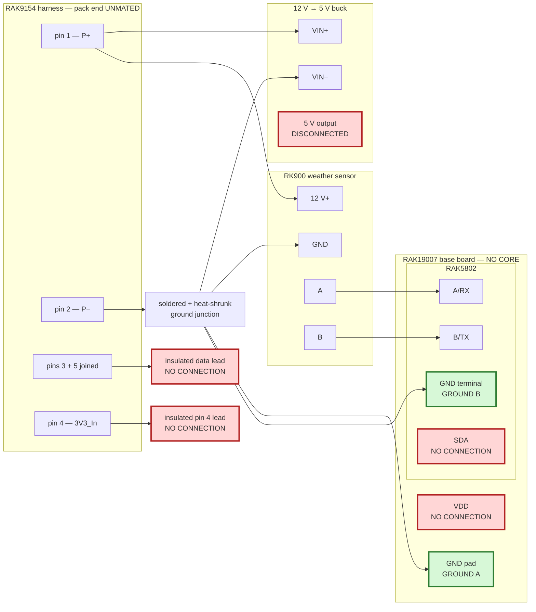

# Node build procedure

This is the assembly procedure. Follow it in order.

`HARDWARE.md` holds pin research, measurements, rejected explanations, and circuit history. It is
not a build sequence. If the two files appear to conflict, **stop**: this file controls assembly,
and the conflict must be resolved before hardware is connected.

## Current stopping point

**Do not install a RAK4631 Core and do not connect the pack data wire to any GPIO.**

The safe procedure currently ends at step 22. Steps after that do not exist yet because the
powered-off isolation circuit and powered contention limit have not passed their bench gates
([#101](https://github.com/disruptivepatternmaterial/rak-sensor-node-but-better/issues/101),
[#102](https://github.com/disruptivepatternmaterial/rak-sensor-node-but-better/issues/102)).

## Required equipment

- RAK19007 WisBlock base board
- RAK5802 RS-485 module with spring terminals
- RK900 weather sensor
- RAK9154 solar battery pack and its 5-pin Sensor Hub Load harness
- 12 V-to-5 V buck converter
- multimeter
- Saleae Logic Pro 8 for any unqualified signal
- current-limited 3.3 V bench supply for the pack-data qualification

Keep the candidate/donor RAK4631 CPU/radio Core somewhere outside the assembly area until step 22
passes.

## A. Assemble only the non-Core wiring

1. Disconnect USB.
2. Unmate the RAK9154 connector.
3. Disconnect the buck from its input.
4. Confirm with the meter that the buck output, base-board `VDD`, pack pin 4, and the free data
   lead are not energised. Record the readings; do not proceed on a non-zero reading.
5. Remove the RAK4631 Core if one is fitted.
6. Fit the RAK5802 in its documented WisBlock IO slot.
7. At pack pin 2 (`P−`), make one soldered and heat-shrunk junction containing:
   - buck input negative;
   - RK900 negative;
   - `GROUND A`;
   - `GROUND B`.
8. Land `GROUND A` on the RAK19007 base-board `GND` pad.
9. Land `GROUND B` in the RAK5802 `GND` spring terminal.
10. Short the meter probes together and record the lead-resistance reading.
11. Measure pack pin 2 to the base-board `GND` pad. Record the resistance. It must remain stable
    while the harness and each termination are moved gently; an overload/open or changing reading
    fails this step.
12. Measure pack pin 2 to the RAK5802 `GND` terminal in the same way. Record the resistance. An
    overload/open or changing reading fails this step.
13. Connect pack pin 1 (`P+`) to both:
    - buck input positive;
    - RK900 12 V positive.
14. Connect RK900 `A` to RAK5802 `A/RX`.
15. Connect RK900 `B` to RAK5802 `B/TX`.
16. Join pack pins 3 and 5 at the pack connector. Terminate the resulting data lead so it cannot
    touch anything. **Do not put it in `SDA`, `A1`, `IO1`, or any other node terminal.**
17. Leave pack pin 4 (`3V3_In`) disconnected and insulated.

### Wiring checkpoint after step 17

Your wiring must match this before taking measurements. Red lines end unconnected. The RAK4631
Core is not fitted, the pack connector is not mated, and the buck output is not connected.



## B. Qualify the actual base board and pack path

18. With every source still disconnected and no Core fitted, meter from the base-board
    edge-header `BAT` pad to each of:
    - `IO1`;
    - `A1`;
    - RAK5802 `SDA`.

    Record all three displays. Each must show the meter's open/overload indication. Any finite or
    unstable reading fails the board; do not install a Core.

19. If this is the same pack and harness as capture 13 in `EVIDENCE.md`, record that existing
    pack-side qualification in the build sheet and continue. If either the pack or harness
    changed, repeat steps 20–21.

20. Qualify a changed pack or harness with **no Core and no base board in the measurement loop**:
    - bench supply OFF;
    - bench-supply negative to pack pin 2;
    - bench-supply positive to pack pin 4;
    - Saleae ground to pack pin 2;
    - Saleae analog channel 0 to the joined pin 3+5 data lead;
    - nothing else on the data lead;
    - set the supply to 3.3 V with a 50 mA current limit;
    - energise pin 4 and capture at least 60 seconds.

    This repeats the setup that produced capture 13. Do not substitute the RAK19007 `VDD` pad:
    its cited datasheet does not establish a 3.3 V source with the Core removed
    [CIT-RAK19007-DS].

21. Export the analog capture and run `scripts/owprobe.py <analog.csv>`. Record its output and raw
    capture path in `EVIDENCE.md`.
    - Exit 0 qualifies only the pack-side voltage under this captured condition.
    - Exit 1 is inconclusive; correct the measurement setup and repeat.
    - Exit 2 fails; isolate the lead and stop.

## C. Stop and record

22. Confirm all of the following:
    - the RAK4631 Core is still not fitted;
    - the pack data lead is insulated and reaches no node terminal;
    - both ground-path readings are recorded;
    - all three `BAT`-isolation readings are recorded;
    - the applicable pack-side analyzer result is recorded.

    Then stop. Do not mate the pack connector to a Core-equipped node.

## What must be added before step 23 can exist

All five items are required:

1. A reviewed isolation schematic. The current candidate is TI `SN74CBTLV1G125`, whose datasheet
   specifies bidirectional operation and at most 10 µA `Ioff` with `VCC = 0 V` and either data
   terminal up to 3.6 V [CIT-SN74CBTLV1G125].
2. An exact output-enable circuit. TI requires `OE` pulled to `VCC` so the switch is open during
   power transitions; no pull-up value or control GPIO has been approved.
3. A selected current-limiting network that meets both the nRF52840 limits and measured 9600-baud
   HIGH/LOW thresholds. The existing 1 kΩ resistor does not pass by precedent: it was fitted when
   `SDA` failed.
4. A no-Core powered-off test proving the Core-side switch terminal remains isolated while the
   pack side is active.
5. A two-sided analyzer capture during the production exchange proving the voltage and current at
   both ends of the current-limiting element.

Until those results are in `EVIDENCE.md`, there is no step that says to install the donor Core.

## Build record

Copy this block into the bench record:

```text
Date:
Base board identifier (or NOT IDENTIFIED):
Pack/harness identifier (or NOT IDENTIFIED):
Meter lead resistance:
Pack pin 2 -> base-board GND:
Pack pin 2 -> RAK5802 GND:
BAT -> IO1:
BAT -> A1:
BAT -> SDA:
Pack-side capture/evidence entry:
Step 22 PASS/FAIL:
```
