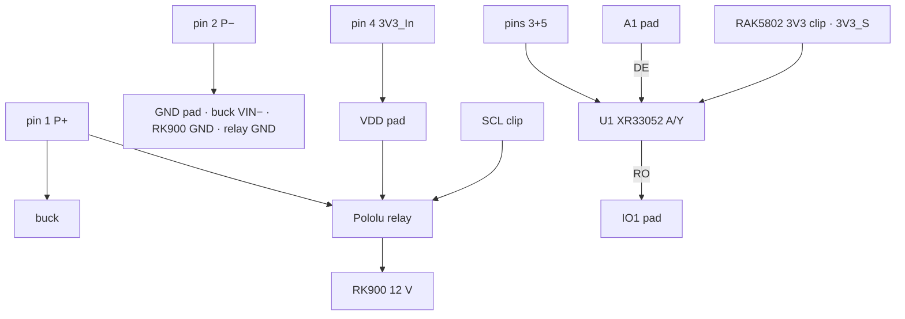
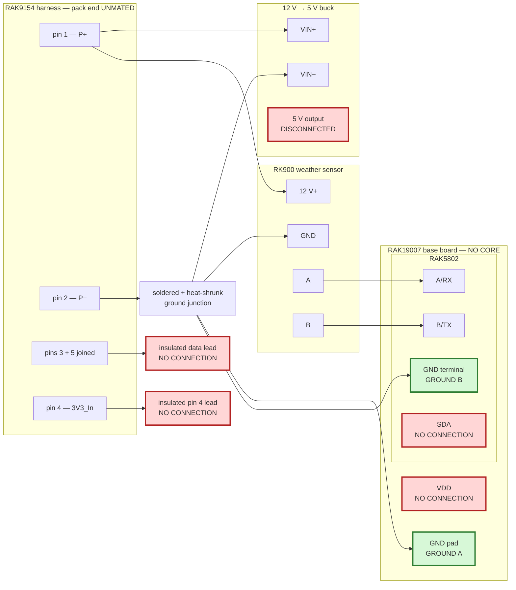

# Node build procedure

This is the assembly procedure. Follow it in order.

`HARDWARE.md` holds pin research, measurements, rejected explanations, and circuit history. It is
not a build sequence. If the two files appear to conflict, **stop**: this file controls assembly,
and the conflict must be resolved before hardware is connected.

## Current stopping point

**The pack data wire never touches a GPIO. It lands on `U1`, an XR33052 RS-485 transceiver, and
only `U1`'s logic outputs reach the Core**
(ADR-0012).

<<<<<<< Updated upstream
The safe procedure currently ends at step 22. Steps after that do not exist yet because the
powered-off isolation circuit and powered contention limit have not passed their bench gates
([#101](https://github.com/disruptivepatternmaterial/rak-sensor-node-but-better/issues/101),
[#102](https://github.com/disruptivepatternmaterial/rak-sensor-node-but-better/issues/102)).
=======
Why: ordinary unplug/replug of the 5-pin plug puts the data wire at `−7.46 … +6.39 V` against
node ground for up to 41 ms, with either buck (`EVIDENCE.md` 2026-09-06 09:24 and 09:51 PDT).
An nRF52840 pad is rated −0.3 … `VDD` + 0.3 V; `U1`'s bus pin is rated ±60 V powered or
unpowered [CIT-XR33052]. The plug is hot-plugged in the field, so the fix is a part, not a
procedure — ADR-0011 is rejected.

Sections A–C build and check everything except `U1` and the Core. Section D qualifies `U1` with
no Core anywhere near it. Section E fits the Core. **Nothing in this document authorizes a
flash**; that is a separate approval every time.

## The build, in one picture

Every wire in the node, one per row. The numbered steps below are these wires in build order.

| # | From | To |
|---|---|---|
| 1 | pack pin 1 `P+` | buck `VIN+` |
| 2 | pack pin 1 `P+` | Pololu relay, one big terminal |
| 3 | Pololu relay, other big terminal | RK900 12 V |
| 4 | pack pin 2 `P−` | base-board `GND` pad |
| 5 | pack pin 2 `P−` | buck `VIN−` |
| 6 | pack pin 2 `P−` | RK900 GND |
| 7 | pack pin 2 `P−` | Pololu relay `GND` |
| 8 | pack pins 3 + 5, joined | `U1` pin 6 `A/Y` — **nothing else, ever** |
| 9 | pack pin 4 `3V3_In` | base-board `VDD` pad |
| 10 | base-board `VDD` pad | Pololu relay `VIN` |
| 11 | RAK5802 `SCL` clip | Pololu relay `EN` |
| 12 | RK900 A | RAK5802 `A/RX` |
| 13 | RK900 B | RAK5802 `B/TX` |
| 14 | buck output | board USB-C |
| 15 | `U1` pin 8 `VCC` | RAK5802 `3V3` clip (`3V3_S`) |
| 16 | `U1` pin 1 `RO` | `IO1` pad (RX) — **section E only** |
| 17 | `U1` pin 3 `DE` | `A1` pad (TX) — **section E only** |
| 18 | `U1` pins 2, 4, 5 (`/RE`, `DI`, `GND`) | node GND |

On the `U1` breakout: 10 kΩ `B/Z`→`3V3_S`, 10 kΩ `B/Z`→GND, 47 kΩ `DE`→GND, 100 nF `VCC`→GND.



| | Rule |
|---|---|
| The plug | Mated and unmated freely, Core fitted or not, powered or not. The data wire is behind `U1`. |
| `U1` | `XR33052ID-F` on a SOIC-8 breakout. `A/Y` is the only component pin on the data wire. `RO` and `DE` stay open until section D passes. |
| `DE` pad | A pad with **no** base-board pull-up: `A1` (default) or `IO1`. Never `SDA` or `SCL` — their 4.7 kΩ pull-ups would enable the driver at reset. |
| `RO` pad | `IO1` (default); `SDA` or `A1` on a Core with a dead `IO1`. |
| `K1` | High-side in the RK900 branch only. Control: `VIN` from the `VDD` pad, `GND` to node ground, `EN` from the `SCL` clip. Firmware for it does not exist yet ([#117](https://github.com/disruptivepatternmaterial/rak-sensor-node-but-better/issues/117)). |
| `VDD` pad | Pack pin 4 and `K1 VIN`. |
| RAK5802 `3V3` clip | `U1 VCC` only. |
| Ground | One common ground: pack pin 2 → base-board `GND` pad, buck `VIN−`, RK900 `GND`, `K1 GND`, `U1 GND`. |
| Not connected | 4-pin Gateway Load socket; RAK5802 `SDA`, `BAT`, `GND`, `AIN` clips; enclosure lid panel. |
>>>>>>> Stashed changes

## Required equipment

- RAK19007 WisBlock base board
- RAK5802 RS-485 module with spring terminals
- RK900 weather sensor
- RAK9154 solar battery pack and its 5-pin Sensor Hub Load harness
- 12 V-to-5 V buck converter
- `U1`: one `XR33052ID-F` [CIT-XR33052] on a SOIC-8-to-DIP breakout, 2 × 10 kΩ, 1 × 47 kΩ,
  1 × 100 nF
- multimeter
- Saleae Logic Pro 8 for any unqualified signal
- current-limited 3.3 V bench supply

<<<<<<< Updated upstream
Keep the candidate/donor RAK4631 CPU/radio Core somewhere outside the assembly area until step 22
passes.
=======
Keep the candidate RAK4631 Core outside the assembly area until section E.
>>>>>>> Stashed changes

## A. Assemble only the non-Core wiring

1. Disconnect USB.
2. Unmate the RAK9154 connector.
3. Disconnect the buck from its input.
4. Confirm with the meter that the buck output, base-board `VDD`, pack pin 4, and the free data
   lead are not energised. Record the readings; do not proceed on a non-zero reading.
5. Remove the RAK4631 Core if one is fitted.
6. Fit the RAK5802 in its documented WisBlock IO slot.
<<<<<<< Updated upstream
7. At pack pin 2 (`P−`), make one soldered and heat-shrunk junction containing:
   - buck input negative;
   - RK900 negative;
   - `GROUND A`;
   - `GROUND B`.
8. Land `GROUND A` on the RAK19007 base-board `GND` pad.
9. Land `GROUND B` in the RAK5802 `GND` spring terminal.
10. Short the meter probes together and record the lead-resistance reading.
11. Measure pack pin 2 to the base-board `GND` pad. Record the resistance. It must remain stable
=======

**Ground.**

7. Wire pack pin 2 (`P−`) to the base-board `GND` pad, and from that same node ground to the
   buck input negative, the RK900 `GND`, and `K1 GND`. Solder and heat-shrink the pin-2 junction.

**Power.**

8. Wire pack pin 1 (`P+`) to the buck input positive and to one `K1` load slot.
9. The other `K1` load slot goes to the RK900 12 V. `K1 VIN` → the base-board `VDD` pad;
   `K1 EN` → the RAK5802 `SCL` clip
   ([#117](https://github.com/disruptivepatternmaterial/rak-sensor-node-but-better/issues/117)).
10. Do not jumper `K1 EN` to `K1 VIN`; do not take `K1 VIN` from the RAK5802 `3V3` clip; do not
    switch the RK900 ground.
11. Confirm the pack plug is still unmated. It stays unmated until step 23.

**Data.**

12. Join pack pins 3 and 5 at the plug. Terminate the resulting data lead so it cannot touch
    anything. **It goes to `U1` pin 6 in section D and nowhere else.**
13. Wire pack pin 4 (`3V3_In`) to the base-board `VDD` pad.

**Checks and the RS-485 pair.**

14. Short the meter probes together and record the lead-resistance reading.
15. Measure pack pin 2 to the base-board `GND` pad. Record the resistance. It must remain stable
>>>>>>> Stashed changes
    while the harness and each termination are moved gently; an overload/open or changing reading
    fails this step.
12. Measure pack pin 2 to the RAK5802 `GND` terminal in the same way. Record the resistance. An
    overload/open or changing reading fails this step.
13. Connect pack pin 1 (`P+`) to both:
    - buck input positive;
    - RK900 12 V positive.
14. Connect RK900 `A` to RAK5802 `A/RX`.
15. Connect RK900 `B` to RAK5802 `B/TX`.
16. Join pack pins 3 and 5 at the pack connector. Terminate the resulting data lead so it cannot
    touch anything. **Do not put it in `SDA`, `A1`, `IO1`, or any other node terminal.**
17. Leave pack pin 4 (`3V3_In`) disconnected and insulated.

### Wiring checkpoint after step 17

<<<<<<< Updated upstream
Your wiring must match this before taking measurements. Red lines end unconnected. The RAK4631
Core is not fitted, the pack connector is not mated, and the buck output is not connected.


=======
Your wiring must match § "The build, in one picture" minus wires 8, 15–18, with the Core not
fitted, the plug not mated, and the buck output not connected.
>>>>>>> Stashed changes

## B. Qualify the actual base board and pack path

18. With every source still disconnected and no Core fitted, meter from the base-board
    edge-header `BAT` pad to each of:
    - `IO1`;
    - `A1`;
    - RAK5802 `SDA`.

    Record all three displays. Each must show the meter's open/overload indication. Any finite or
    unstable reading fails the board; do not install a Core.

19. If this is the same pack and harness as capture 13 in `EVIDENCE.md`, record that existing
    pack-side qualification in the build sheet and continue. If either the pack or harness
    changed, repeat steps 20–21.

20. Qualify a changed pack or harness with **no Core and no base board in the measurement loop**:
    - bench supply OFF;
    - bench-supply negative to pack pin 2;
    - bench-supply positive to pack pin 4;
    - Saleae ground to pack pin 2;
    - Saleae analog channel 0 to the joined pin 3+5 data lead;
    - nothing else on the data lead;
    - set the supply to 3.3 V with a 50 mA current limit;
    - energise pin 4 and capture at least 60 seconds.

    This repeats the setup that produced capture 13. Do not substitute the RAK19007 `VDD` pad:
    its cited datasheet does not establish a 3.3 V source with the Core removed
    [CIT-RAK19007-DS].

21. Export the analog capture and run `scripts/owprobe.py <analog.csv>`. Record its output and raw
    capture path in `EVIDENCE.md`.
    - Exit 0 qualifies only the pack-side voltage under this captured condition.
    - Exit 1 is inconclusive; correct the measurement setup and repeat.
    - Exit 2 fails; isolate the lead and stop.

## C. Record before `U1`

<<<<<<< Updated upstream
22. Confirm all of the following:
    - the RAK4631 Core is still not fitted;
    - the pack data lead is insulated and reaches no node terminal;
    - both ground-path readings are recorded;
    - all three `BAT`-isolation readings are recorded;
    - the applicable pack-side analyzer result is recorded.

    Then stop. Do not mate the pack connector to a Core-equipped node.

## What must be added before step 23 can exist

All five items are required:

1. A reviewed isolation schematic. The current candidate is TI `SN74CBTLV1G125`, whose datasheet
   specifies bidirectional operation and at most 10 µA `Ioff` with `VCC = 0 V` and either data
   terminal up to 3.6 V [CIT-SN74CBTLV1G125].
2. An exact output-enable circuit. TI requires `OE` pulled to `VCC` so the switch is open during
   power transitions; no pull-up value or control GPIO has been approved.
3. A selected current-limiting network that meets both the nRF52840 limits and measured 9600-baud
   HIGH/LOW thresholds. The existing 1 kΩ resistor does not pass by precedent: it was fitted when
   `SDA` failed.
4. A no-Core powered-off test proving the Core-side switch terminal remains isolated while the
   pack side is active.
5. A two-sided analyzer capture during the production exchange proving the voltage and current at
   both ends of the current-limiting element.

Until those results are in `EVIDENCE.md`, there is no step that says to install the donor Core.
=======
23. Confirm all of the following and write them into the build record:
    - the RAK4631 Core is still not fitted;
    - the pack data lead is insulated and reaches no node terminal;
    - the pin-1 readings from step 17, both ground-path readings, all three `BAT`-isolation
      readings, and the pack-side analyzer result are recorded.

## D. Qualify `U1` with no Core

`U1` is qualified inside the node, with the base board present and the Core absent. Bench supply
means the current-limited 3.3 V / 50 mA source.

24. Assemble the breakout: `XR33052ID-F`, 10 kΩ `B/Z`→`VCC`, 10 kΩ `B/Z`→GND, 47 kΩ `DE`→GND,
    100 nF `VCC`→GND, `DI` and `/RE` to GND. Leave `RO` and `DE` on open pins.
25. **G1 — continuity, unpowered.** Meter from the `A/Y` pin to `RO`, to `DE`, to `VCC`, and to
    GND: all open (megohms). Meter `VCC` to GND: open. Record.
26. Wire `U1 GND` to node ground and the joined pack pins 3+5 to `U1 A/Y`. Leave `U1 VCC` off
    the `3V3` clip for now. Mate the pack plug. The node is still unpowered; `RO` and `DE` are
    open.
27. **G2 — receive.** Bench supply negative to node ground; positive to `U1 VCC` **and** to the
    base-board `VDD` pad (with no Core that pad is an isolated net, and it is what powers pack
    pin 4 — [ADR-0010](decisions/ADR-0010-rak19007-vdd-source-conflict.md)). Analyzer channels
    on the data wire and on `RO`, ground on node ground. Capture ≥ 60 s. `RO` must be 0–3.3 V
    logic and reproduce every 9600 8N1 pack byte on the wire. Record.
28. **G3 — transmit.** With the supply still on, touch `DE` to 3.3 V through a 1 kΩ lead while
    watching the data wire: it must fall to a LOW you record (the pack accepted 0.09 V from
    itself). Release `DE`: the wire must return to the pack's 3.3 V. Confirm the wire is never
    driven above the pack's own idle level. Record both levels.
29. **G4 — mate/unmate, powered and unpowered.** Analyzer on the data wire, `RO`, `U1 VCC`,
    and node ground. Unplug and replug the pack plug at least three times with the supply on,
    then at least three times with it off. Run `scripts/owprobe.py` on the `RO` channel against
    the `VCC` channel: `RO` must stay within `GND − 0.3 V … VCC + 0.3 V` on every sample. The
    wire will not, and that is expected. A saturated channel is a fail. Record both captures.
30. Turn every source off and remove the bench supply. Record G1–G4 in `EVIDENCE.md` with the
    instrument identity and raw capture paths. Any failed gate ends this build before a Core.

## E. Fit the Core

31. With every source off, meter the candidate Core's `IO1`, `A1`, and `SDA` to its `GND`
    (megohms). Record its die identity (USB serial or `FICR.DEVICEID`). A short fails.
32. Wire `U1 VCC` to the RAK5802 `3V3` clip (wire 15). Fit the Core. Connect `U1 RO` to the
    `IO1` pad and `U1 DE` to the `A1` pad. Connect the buck output to the board USB-C.
33. Repeat G4 once with the Core fitted and the node powered from the pack. `RO` within rails,
    every sample. Record.
34. Build the two-pin `battdiag` image on Heliotrope Ridge at the recorded commit SHA. Flashing is
    a separate destructive step and requires explicit operator approval.
35. After an approved flash: one real non-null battery record and the measured wire LOW during
    the node's own transmit. Then the normal ≥ 24 h bench soak and ≥ 7 d field shadow.
>>>>>>> Stashed changes

## Build record

Copy this block into the bench record:

```text
Date:
Base board identifier (or NOT IDENTIFIED):
Pack/harness identifier (or NOT IDENTIFIED):
Meter lead resistance:
Pack pin 2 -> base-board GND:
<<<<<<< Updated upstream
Pack pin 2 -> RAK5802 GND:
BAT -> IO1:
BAT -> A1:
BAT -> SDA:
Pack-side capture/evidence entry:
Step 22 PASS/FAIL:
=======
Pack pin 2 -> RK900 GND / buck VIN-:
Pack pin 1 -> buck VIN+ / K1 load:
BAT -> IO1:
BAT -> A1:
BAT -> SDA:
Pack-side capture/evidence entry (capture 13 or new):
Step 23 complete (must be YES):
U1 part marking:
G1 A/Y -> RO / DE / VCC / GND, and VCC -> GND (all open):
G2 receive capture/evidence entry:
G3 wire LOW with DE high / wire HIGH with DE released:
G4 powered mate/unmate capture/evidence entry:
G4 unpowered mate/unmate capture/evidence entry:
G1-G4 PASS/FAIL:
Core die ID (or NOT CAPTURED):
Loose Core IO1 -> GND:
Loose Core A1 -> GND:
Loose Core SDA -> GND:
G4 with Core fitted capture/evidence entry:
Firmware host / SHA:
Approved flash evidence entry:
First real battery record / measured transmit LOW:
>>>>>>> Stashed changes
```
