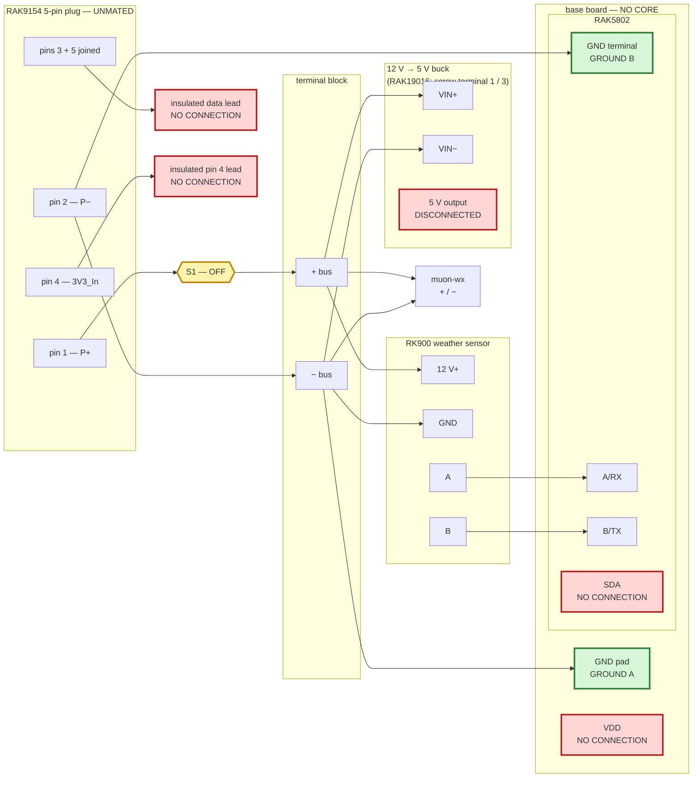

# Node build procedure

This is the assembly procedure. Follow it in order.

`HARDWARE.md` holds pin research, measurements, rejected explanations, and circuit history. It is
not a build sequence. If the two files appear to conflict, **stop**: this file controls assembly,
and the conflict must be resolved before hardware is connected.

## Current stopping point

**Do not install a RAK4631 Core and do not connect the pack data wire to any GPIO.**

The safe procedure currently ends at step 23. Steps after that do not exist yet because the
harness with the `S1` load disconnect of
[ADR-0011](decisions/ADR-0011-no-current-across-the-plug-while-mating.md) has not passed its
coreless mating test
([#102](https://github.com/disruptivepatternmaterial/rak-sensor-node-but-better/issues/102)).

**Why `S1` exists** (measured 2026-09-05, `EVIDENCE.md`): on the 5-pin plug, `P−` lands ~180 ms
after `P+` and the data pin, and the node's supply current returns through the data wire at
−8.1 V. `S1` is open whenever the plug is mated or unmated, so no current is flowing when the
contacts land. Rationale and the two-base-board comparison: `HARDWARE.md` § "The wiring plan".

## Required equipment

- RAK19007 WisBlock base board (bench fixture; the RAK19010 + RAK19016 field base follows the
  same steps with the screw terminal in place of the buck — noted inline)
- RAK5802 RS-485 module with spring terminals
- RK900 weather sensor
- RAK9154 solar battery pack and one SP11 plug mating its 5-pin `Sensor Hub Load` socket
  (`SP1110/P5`) [CIT-RAK-WX-MANUAL]
- **`S1`** — a toggle/rocker switch or an inline blade-fuse holder, rated ≥ 2 A at 13.2 V DC,
  with a label reading `OFF before plugging or unplugging the pack`
- a terminal block for the `P+`/`P−` fan-out inside the enclosure
- 12 V-to-5 V buck converter (RAK19007 build only)
- multimeter
- Saleae Logic Pro 8 for any unqualified signal
- current-limited 3.3 V bench supply for the pack-data qualification

Keep the candidate/donor RAK4631 CPU/radio Core somewhere outside the assembly area until step 23
passes.

## A. Assemble only the non-Core wiring

1. Disconnect USB.
2. Unmate the RAK9154 plug.
3. Disconnect the buck from its input (RAK19016: nothing on the screw terminal).
4. Confirm with the meter that the buck output, base-board `VDD`, pack pin 4, and the free data
   lead are not energised. Record the readings; do not proceed on a non-zero reading.
5. Remove the RAK4631 Core if one is fitted.
6. Fit the RAK5802 in its documented WisBlock IO slot.

**Ground.**

7. Wire pack pin 2 (`P−`) to the terminal block's `−` bus. From that bus, one conductor each to:
   - buck input negative (RAK19016: screw terminal **pin 3 `GND`**);
   - RK900 negative;
   - muon-wx negative;
   - `GROUND A` → the base-board `GND` pad.
8. From pack pin 2, a **second** conductor, `GROUND B` → the RAK5802 `GND` spring terminal. Make
   the pin-2 junction soldered and heat-shrunk.

**Power, through `S1`.**

9. Wire pack pin 1 (`P+`) to one terminal of `S1`. Nothing else connects to pin 1.
10. Wire the other terminal of `S1` to the terminal block's `+` bus. From that bus, one conductor
    each to:
    - buck input positive (RAK19016: screw terminal **pin 1 `VCC_IN`**; pin 2 of that terminal
      is unconnected on the module [CIT-RAK19016-SCH]);
    - RK900 12 V positive;
    - muon-wx positive.
11. Set `S1` **OFF** and fit its label. Mount it where it can be operated with the lid open and
    nothing unplugged.

**Data.**

12. Join pack pins 3 and 5 at the plug. Terminate the resulting data lead so it cannot touch
    anything. **Do not put it in `SDA`, `A1`, `IO1`, or any other node terminal.**
13. Leave pack pin 4 (`3V3_In`) disconnected and insulated.

**Checks and the RS-485 pair.**

14. Short the meter probes together and record the lead-resistance reading.
15. Measure pack pin 2 to the base-board `GND` pad. Record the resistance. It must remain stable
    while the harness and each termination are moved gently; an overload/open or changing reading
    fails this step.
16. Measure pack pin 2 to the RAK5802 `GND` terminal in the same way. Record the resistance.
17. With `S1` OFF, measure pack pin 1 to the terminal block's `+` bus: **must read open.** Switch
    `S1` ON, repeat: must read the lead resistance from step 14. Switch `S1` **OFF** again and
    record both readings.
18. Connect RK900 `A` to RAK5802 `A/RX` and RK900 `B` to RAK5802 `B/TX`.

### Wiring checkpoint after step 18

Your wiring must match this before taking measurements. Red lines end unconnected. The RAK4631
Core is not fitted, the plug is not mated, `S1` is OFF, and the buck output is not connected.



## B. Qualify the actual base board and pack path

19. With every source still disconnected and no Core fitted, meter from the base-board
    edge-header `BAT` pad to each of:
    - `IO1`;
    - `A1`;
    - RAK5802 `SDA`.

    Record all three displays. Each must show the meter's open/overload indication. Any finite or
    unstable reading fails the board; do not install a Core.

20. If this is the same pack and harness as capture 13 in `EVIDENCE.md`, record that existing
    pack-side qualification in the build sheet and continue. Adding `S1` does not change the
    pack-side data path, so an existing capture-13 result for the same pack and plug still stands;
    a new pack or a new plug means repeating steps 21–22.

21. Qualify a changed pack or harness with **no Core and no base board in the measurement loop**:
    - bench supply OFF;
    - bench-supply negative to pack pin 2;
    - bench-supply positive to pack pin 4;
    - Saleae ground to pack pin 2;
    - Saleae analog channel 0 to the joined pin 3+5 data lead;
    - nothing else on the data lead;
    - set the supply to 3.3 V with a 50 mA current limit;
    - energise pin 4 and capture at least 60 seconds.

    This repeats the setup that produced capture 13. Do not substitute a coreless RAK19007 `VDD`
    pad: with the Core removed that pad is open-circuit — the base board's `3V3` reaches it only
    through the Core's connector
    ([ADR-0010](decisions/ADR-0010-rak19007-vdd-source-conflict.md), [CIT-RAK4631-SCH]).

22. Export the analog capture and run `scripts/owprobe.py <analog.csv>`. Record its output and raw
    capture path in `EVIDENCE.md`.
    - Exit 0 qualifies only the pack-side voltage under this captured condition.
    - Exit 1 is inconclusive; correct the measurement setup and repeat.
    - Exit 2 fails; isolate the lead and stop.

## C. Stop and record

23. Confirm all of the following:
    - the RAK4631 Core is still not fitted;
    - the pack data lead is insulated and reaches no node terminal;
    - `S1` is OFF, labelled, and both its OFF/ON readings from step 17 are recorded;
    - both ground-path readings are recorded;
    - all three `BAT`-isolation readings are recorded;
    - the applicable pack-side analyzer result is recorded.

    Then stop. Do not mate the plug to a Core-equipped node.

## What must be added before step 24 can exist

[ADR-0011](decisions/ADR-0011-no-current-across-the-plug-while-mating.md) § "Exit criteria", all
three in `EVIDENCE.md` with host and SHA:

1. **Coreless mating test, this harness:** analyzer ground on the base-board `GND` pad, analog
   channel on the joined pins 3+5 lead, buck output connected so the board powers from the pack
   exactly as it will in the field. Each cycle: `S1` OFF → mate → `S1` ON → (pause) → `S1` OFF →
   unmate. ≥ 10 cycles. **Pass = the data lead never goes below −0.3 V.** Runs 6 and 7
   (2026-09-05, same harness without `S1`, ~25 matings, every one below −0.3 V) are the control.
2. **The same, ≥ 3 cycles with `S1` left ON**, recorded — to confirm the switch is the variable
   and not the day.
3. **First core:** meter the incoming core's `IO1`, `A1`, `SDA` to `GND` (megohms), fit it, land
   the data lead in `SDA` and pin 4 on `VDD`, one cycle by the procedure, re-meter the pad
   afterwards.

Until those results are in `EVIDENCE.md`, there is no step that says to install the donor Core.
The isolation switch of #101 (`SN74CBTLV1G125`) is no longer a prerequisite: it guards the
unpowered-node case, which is not the measured mechanism, and an ESD-class part is not rated for
183 ms of reverse conduction.

## Build record

Copy this block into the bench record:

```text
Date:
Base board identifier (or NOT IDENTIFIED):
Pack/harness identifier (or NOT IDENTIFIED):
Meter lead resistance:
Pack pin 2 -> base-board GND:
Pack pin 2 -> RAK5802 GND:
Pack pin 1 -> + bus, S1 OFF (must be open):
Pack pin 1 -> + bus, S1 ON:
S1 left OFF and labelled? (must be YES):
BAT -> IO1:
BAT -> A1:
BAT -> SDA:
Pack-side capture/evidence entry:
Step 23 PASS/FAIL:
```
