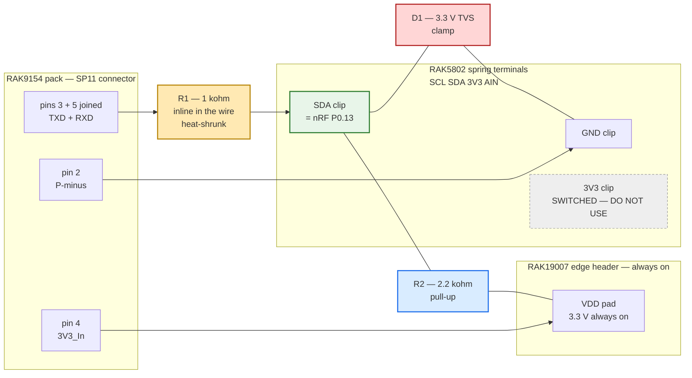
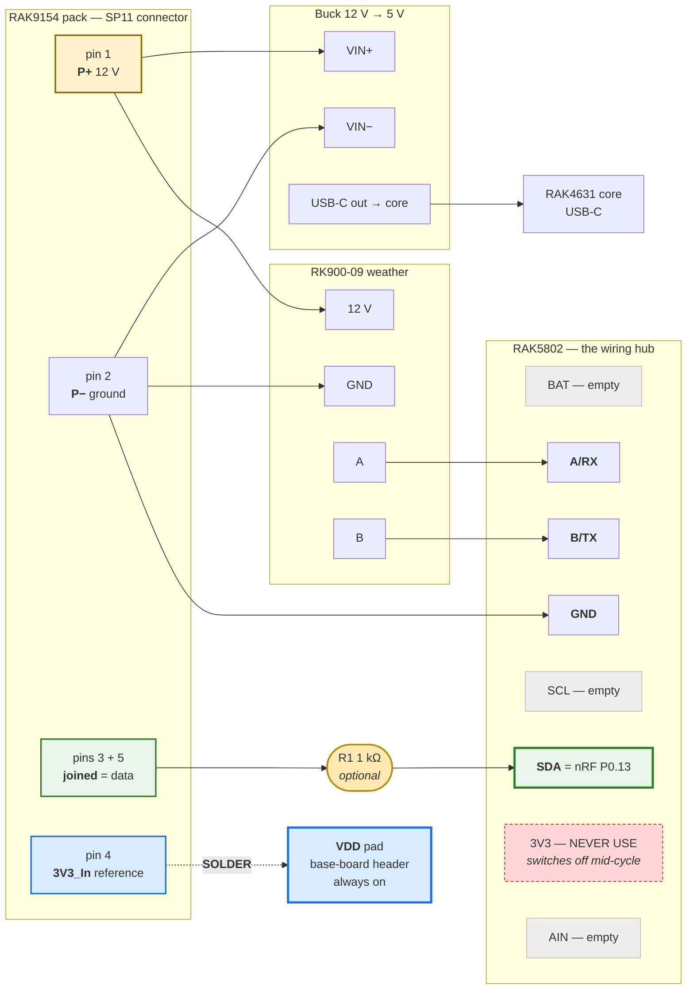

# Hardware — WisBlock RK900 + RAK9154 node

🚧 **NOT YET BUILT.** Bench/field status: none.

Authoritative behavior: [`FIRMWARE_SPEC.md`](FIRMWARE_SPEC.md). Libraries: [`LIBRARIES.md`](LIBRARIES.md).

## Mission

Class A LoRaWAN US915 end node: poll **RK900-09** + **RAK9154**, uplink on downlink-settable interval, woods-hardened.

## BOM (ordered path)

| Role | Part | SKU |
|---|---|---|
| Core | RAK4631 US915 | **116000** |
| Base | RAK19007 | **110082** |
| RS-485 | RAK5802 | **100003** |
| Antenna | Blade 915 RP-SMA (if needed) | **926019** |
| Enclosure | Unify **solar** variant — the no-solar 910406 was out of stock | **910421** (confirm) |
| Buck | 12 V → 5 V | (separate) |
| Power source | RAK9154 Solar Battery Lite, **large-panel variant** | — |

**Not used:** RAK13002 (conflicts with 5802 IO slot), GNSS, RTC, AS923 kit **119012**.

### The enclosure that arrived has its own solar panel — and we do not want to use it

Planning assumed the no-solar 910406. Only the solar variant was available, so the shell in
hand has panel mounting and, unlike 910406, is roomy enough for the buck converter with
space to spare. Both of those are fine. The panel is the problem, and it is a decision
rather than a detail:

**The RAK9154 must remain the power source, and the enclosure's panel should be left
unconnected.** Half the firmware exists to read that pack — voltage, current, state of
charge, and temperature come over the one-wire link on its 5-pin socket
([ADR-0004](decisions/ADR-0004-bms-one-wire-path.md)), the low-voltage gate in
`src/power.h` decides whether to transmit based on what it reports, and four of the nine
uplink fields come from it. Powering the node from the enclosure panel instead would mean
no pack to interrogate: `BatteryReading` would be permanently absent, the brownout gate
would have nothing to act on, and the node would lose the ability to tell anyone it was
running out of energy.

Wiring both panels into the pack's charge input is also not the answer — the RAK9154 has
its own 18 V charge controller expecting one array, and a second uncontrolled source on the
same input is a good way to damage it.

So the enclosure's panel is dead weight here. That is acceptable; it was a stock
substitution, not a design change. Do not "make use of it" without revisiting this.

**The RAK9154 is solar-recharged in its own right:** 56.16 Wh pack, integrated 18 V charge
controller, BMS, and heater, with a 10 W panel in the regular variant [CIT-RAK9154-SOLAR].
This deployment uses the large panel. The system was always solar; only the shell was not.
This was previously stated wrong in [`POWER_BUDGET.md`](POWER_BUDGET.md) and matters a great
deal to the design — see that page.

**To confirm on the bench:** the exact SKU, how many cable entries the shell actually has,
and whether the lid panel terminates in a bare lead or a connector. Cable entry planning is
issue #20 and the premise changed with the shell.

**Select the buck on its no-load quiescent current.** It is a 24/7 load in parallel with
everything the firmware does, and a part drawing several milliamps at idle would exceed the
node's entire average draw on its own.

## RAK9154 ports (critical)

The pack has **two** load sockets. Connector reference:
`forest-weather-machines/rak-4-5-wire/docs/01-connector-reference.md` [CIT-RAK45WIRE] —
the sibling repo is cloned at `~/Documents/GitHub/forest-weather-machines`, not beside this
repo, so it is cited rather than linked. See [`CITATIONS.md`](CITATIONS.md).

### A — 4-pin Gateway Load (SP11/P4) — BMS Modbus — **fallback only**

Superseded by [ADR-0004](decisions/ADR-0004-bms-one-wire-path.md): the battery uses the
one-wire path on socket B. This socket stays unused and available if one-wire proves
unreliable on the bench.

| Pin | Signal |
|---|---|
| 1 | P+ (~12 V) → buck only |
| 2 | P− → GND |
| 3 | RS-485 A |
| 4 | RS-485 B |

Modbus slave **0x6E**, **9600** 8N1. Register map: FIRMWARE_SPEC §2.2 / RAK2560 settings §5d.

### B — 5-pin Sensor Hub Load (SP11/P5) — power + one-wire — **chosen**

**Mating part: `SP1110/P5-N` plug** (SP11 series, IP67, screw-locking circular, 2 A, 0.75 mm
contacts × 5). The socket on the pack is `SP1110/P5`; the cable-end plug that mates with it is
the `-N` variant [CIT-RAK9154]. Buying the plug is preferable to cutting the supplied cable,
which keeps the assembly weatherproof and reversible.

The connector visible **inside** a Sensor Hub shell is the board-side end of that bulkhead and
is a different, unpublished part — RAK does not document it, so it cannot be ordered by part
number. Measure the pin pitch before assuming a JST family (1.0 mm SH, 1.25 mm GH, 1.5 mm ZH,
and 2.0 mm PH all look alike in a photograph). Mating it saves a gland but ties the build to an
undocumented part.

| Pin | Signal | Notes |
|---|---|---|
| 1 | P+ (~12 V) | Splits two ways: buck VIN+, **and** the RK900's 12 V supply |
| 2 | P− | GND — shared return for the buck, the RK900, and the RS-485 reference |
| 3 | TXD | Half-duplex data (bridge to pin 5 for one-wire) |
| 4 | 3V3_In | Level ref / probe rail — tie carefully to 3V3, **never 5 V** |
| 5 | RXD | Bridge to TXD for one-wire |

**Not** full-duplex UART to RX1/TX1 as two independent lines without bridging — Hub protocol is half-duplex one-wire @ 9600. See Meshtastic / RAK-OneWireSerial / `rak-4-5-wire`.

## RAK5802 terminal blocks — what each one actually is

Two 4-way spring terminals, silkscreened `BAT GND A/RX B/TX` and `SCL SDA 3V3 AIN`. Eight clips
total. **Six of the node's seven external connections land in them**, which is why the build below
uses this module as the wiring hub rather than the base-board header.

| Block | Clip | What it is | What this node puts in it |
|---|---|---|---|
| 1 | `BAT` | battery rail **output**, 2.6–4.2 V, for powering a sensor [CIT-RAK5802] | *empty* |
| 1 | `GND` | common ground — same net as the base-board `GND` pad | pack pin 2 (`P−`) |
| 1 | `A/RX` | RS-485 A, non-inverting | RK900 `A` |
| 1 | `B/TX` | RS-485 B, inverting | RK900 `B` |
| 2 | `SCL` | I²C clock, an otherwise unused GPIO | *empty* |
| 2 | `SDA` | **nRF P0.13 — the one-wire pin**, direct passthrough, no buffer | pack pins 3+5 joined |
| 2 | `3V3` | **switched** output on `3V3_S` — dies mid-cycle | *empty. never use* |
| 2 | `AIN` | one analog input | *empty* |

Each clip takes **one** conductor. `P−` has to fan out to the buck negative and the RK900 negative
as well, so that junction is made at the pack connector and a single wire runs from it to `GND`.

**`BAT` and `3V3` are outputs to power a sensor, not supply inputs.** Neither can run the RK900,
which needs 12 V — that comes from the pack, through the buck, and never through this module.

**Do not take the pack's `3V3_In` (pin 4) from the RAK5802's `3V3` terminal.** That terminal sits
on `3V3_S`, which `WB_IO2` switches, and `src/sensors/rk900.cpp` deliberately drops `WB_IO2` LOW
when it finishes reading the weather station in order to power the transceiver down. The battery
is read *after* the weather station, so the pack's reference would be dead exactly when it is
needed, and the symptom would be a battery that never replies — easy to misread as a wiring or
protocol fault. Take pin 4 from the always-on `VDD` pad on the base-board header instead.

## RK900

4-wire: V+, GND, A, B → RAK5802 @ **9600**, slave `0x01`. Probe IO optional as junction box
only. The datasheet and the one field-deployed twin both say 4800; **this physical unit
answers only at 9600** and gives zero bytes at 4800 across four consecutive sweeps
([ADR-0006](decisions/ADR-0006-rk900-baud-and-register-map.md), 2026-08-03, `998dc26`).
Wiring from 4800 costs a bench session debugging a bus that is silent by configuration.

## P0 wiring — decided

Per [ADR-0004](decisions/ADR-0004-bms-one-wire-path.md). The two sensors are on **separate
buses**, so neither can interfere with or block the other.

### The two power rules, stated plainly

> **12 V positive (`P+`) goes to BOTH the buck VIN+ AND the RK900's 12 V input.**
>
> **12 V negative (`P−`) goes to ALL THREE: the buck negative, the RK900's negative, and the
> `GND` pad on the base-board header.**

The base-board `GND` pad is the one that matters and it used to be missing from this rule, which
is how a review on 2026-08-30 talked itself into a ground-float failure mechanism that does not
exist. It is bonded twice over: directly by this wire, and again through the buck, which is
non-isolated and therefore shares input and output ground whether or not it is converting.
`GND` on the RAK5802 is not in the path as built.

Both rails split. Nothing is daisy-chained through the RAK5802, and nothing is exclusive.

### The two data rules, stated plainly

> **Pack pins 3 and 5 (TXD and RXD) are joined together, and that single joined wire goes to
> the `SDA` pad on the base board — through the protection network below, never straight to
> the pad.**
>
> **Pack pin 4 (`3V3_In`) goes to the `VDD` pad on the base board. Not to the RAK5802's `3V3`
> terminal, and never to 5 V.**

Both pads are on the 2.54 mm header along the edge of the RAK19007, silkscreened
`BAT IO2 IO1 A1 IN1` and `SDA SCL TX1 RX1 GND VDD BOOT0`. Neither signal appears on any screw
terminal, so both are solder joints.

### THE RULE THAT SAVES PINS — connector sequencing

**Cause established 2026-08-30.** Four dead pads across four cores, and in every case the dead pad
was the pad carrying the pack. The mechanism is not the protocol and not `owscan`; it is that
**the pack's data line is live while the core has no power.** Nordic states the limit and the
consequence [CIT-NRF-BACKPOWER]:

> "Max voltage on any GPIO is VDD + 0.3 V. Meaning that for an **unpowered** device, max GPIO
> voltage is **0.3 V**. Any voltage above this level will make the ESD protection diode conduct and
> you will backpower the device via the GPIO."

The pack idles its data line at a level referenced to `3V3_In` and has no idea whether the core is
powered. So an unpowered core with the harness mated sees ~3.3 V on a 0.3 V maximum, and the
current goes in through the pad's ESD diode. Nordic's word for the result is "the high current flow
can permanently damage the pin" [CIT-NRF-PINSHORT] — which is the ~3.9 Ω-to-ground signature
measured on all four.

**Why this bites this build in particular:** the buck powers the core *through the USB-C connector*,
so the buck and a host cable are mutually exclusive. Every swap between bench and pack power
therefore contains a window with the core dark and the harness mated. Node 002 went through that
window a dozen times in one day of bring-up. Node 001 was wired once and deployed, and has never
been through it — that is the entire difference between them.

> **Order of operations. Follow it every single time.**
>
> | Going to bench USB | Going to pack / buck |
> |---|---|
> | 1. **Unmate the pack connector first** | 1. **Connect the buck first** |
> | 2. Then remove buck power | 2. Then mate the pack connector |
> | 3. Then plug in host USB | 3. Then confirm the boot banner |
>
> The pack connector is mated **last** and unmated **first**. Always.

Hot-plugging is the same hazard with a worse edge: on a mating connector the pins touch in an
unpredictable order, and wire inductance during the plug can break down the clamp diode on its own
[CIT-NRF-UNPOWERED-PIN].

### REQUIRED — the one-wire protection network

The sequencing rule above is the fix. This resistor is the **insurance against forgetting it**,
and it is worth fitting precisely because the rule will eventually be forgotten at 9 p.m. with
cold hands.

Nordic's damage mode is **current** through the ESD diode, not voltage across it
[CIT-NRF-BACKPOWER]. A bare wire limits that current only by the diode's own resistance. **1 kΩ
bounds it to about 3 mA**, which the pin survives indefinitely — so the resistor converts a
sequencing mistake from fatal into a non-event
([`reviews/2026-08-30_onewire_pin_failures.md`](reviews/2026-08-30_onewire_pin_failures.md),
[#96](https://github.com/disruptivepatternmaterial/rak-sensor-node-but-better/issues/96)).

**The whole build is one resistor.** Put a 1 kΩ resistor inline in the pack's data wire and land
it in the RAK5802's `SDA` spring clip. That is it. Nothing is soldered to the board.

The series resistor is the part that actually saves the pin: it limits the current into P0.13 in
every failure mode at once — a stuck driver, a hot-plug transient, a miswire onto the 12 V rail —
without needing to know which one killed the last four. Fit it on **every** node.

| Ref | What | Value | Suggested part |
|---|---|---|---|
| **R1** | resistor | 1 kΩ, ¼ W | any through-hole 1 kΩ |

#### Optional refinements — skip these unless a pin dies again

R1 alone is the deal. The two parts below sharpen it and are worth adding on a node you are about
to leave in the woods for a year, but they are not the difference between working and not, and a
node built with R1 only is a node this project considers correctly built.

| Ref | What | Value | Suggested part | What it adds |
|---|---|---|---|---|
| **R2** | resistor | 2.2 kΩ, ¼ W | any through-hole 2.2 kΩ | pulls the idle level clear of the 1.7 V grey zone the pack's 15 kΩ pull-down creates. **Must reference the board's own `VDD` pad, never an external rail** — a pull-up to an external supply back-powers the nRF through the pin when the board is off [CIT-PARTICLE-BACKPOWER] |
| **D1** | 3.3 V bidirectional TVS / ESD diode | 3.3 V working voltage | Nexperia `PESD3V3L1BA`, Littelfuse `PESD3V3S1UB`, any 3.3 V TVS | clamps a spike faster than R1 alone can bleed it |

A **bidirectional** TVS has no polarity, so it cannot be fitted backwards — that is why it beats a
`BAT54S` here. Check the part's own datasheet for its **working** voltage, not its breakdown
voltage, before fitting.

#### Where it lands — use the RAK5802 spring terminals, not the soldered pad

`WB_I2C1_SDA` is P0.13, and `variant.h` marks it `SENSOR_SLOT IO_SLOT` — so it appears **both** on
the base-board edge header **and** on the RAK5802's second spring terminal block, silkscreened
`SCL SDA 3V3 AIN`. RAKwireless documents that block as a "reserved I2C expansion interface", a
direct passthrough with no buffer or isolation; the module's 18 kV ESD protection is on the RS485
side only [CIT-RAK5802].

**Land the pack's data wire in the RAK5802's `SDA` spring terminal.** It is the same net as the
pad, and it is better in three ways: no soldering, trivial rework, and it keeps you entirely off
the 2.54 mm header row where all four dead pads have been.

> **Trap — do not use the RAK5802's `3V3` terminal for anything.** That terminal sits on the
> switched `3V3_S` rail, and `src/sensors/rk900.cpp` deliberately drops `WB_IO2` LOW after each
> weather read. A pull-up or a reference taken from there vanishes partway through every cycle,
> and the symptom is a battery that reads intermittently — very easy to misread as a protocol
> fault. R2 and pack pin 4 both come from the always-on **`VDD` pad** on the edge header.

`GND` on the same terminal block is common ground and is fine for D1 and for the harness ground
wire.

#### Schematic



The same thing as a plain schematic, because the boxes above hide the topology:

```
 pack pin 3 ─┐
             ├─ (joined) ── R1 1 kohm ──┬────────── RAK5802 "SDA" spring clip  (nRF P0.13)
 pack pin 5 ─┘                          │
                                        ├── R2 2.2 kohm ──── VDD pad  (edge header, always on)
                                        │
                                        └── D1 TVS ───────── RAK5802 "GND" spring clip

 pack pin 2 (P-minus) ───────────────────────────────────── RAK5802 "GND" spring clip
 pack pin 4 (3V3_In)  ───────────────────────────────────── VDD pad  (edge header)

 RAK5802 "3V3" clip ── UNUSED. Switched rail, dies mid-cycle.
```

**R1 is the only thing between the pack and everything else.** D1 and R2 both attach on the
board side of R1. That ordering is the design: R1 limits the current, then D1 and R2 protect and
bias a node R1 has already made safe.

#### The whole node, one picture

Solid lines are spring clips. The single dashed line is the one solder joint.



Read it as five wires out of the pack:

| Pack pin | Goes to | How |
|---|---|---|
| 1 `P+` 12 V | buck `VIN+` **and** RK900 12 V | never touches the RAK5802 |
| 2 `P−` | buck `VIN−`, RK900 `GND`, and the `GND` clip | junction at the connector, one wire to the clip |
| 3 + 5 joined | `SDA` clip, through R1 if fitted | **the one-wire link** |
| 4 `3V3_In` | `VDD` pad | **the only solder joint** |

Plus the RK900's own two data wires, `A` → `A/RX` and `B` → `B/TX`.

#### Build steps

**There is exactly one solder joint on the whole node: pack pin 4 to the `VDD` pad.** Everything
else is a spring clip. Pin 4 cannot use a clip because the module's `3V3` clip switches off
mid-cycle and its `BAT` clip is the wrong voltage and an output.

1. **Power everything down.** USB unplugged, pack connector unmated. Nothing energised while a
   wire is being moved — see the hot-plug rule below, it is the one mechanism that fits all four
   dead pads.
2. **At the pack connector, join pins 3 and 5.** One wire leaves that junction. That is the data
   line.
3. **At the pack connector, join pin 2 (`P−`) to the buck negative and the RK900 negative.** One
   wire leaves that junction too.
4. **Pack pin 1 (`P+`, 12 V) to the buck `VIN+` and the RK900 12 V input.** This never touches the
   RAK5802.
5. **Into the clips:** data wire → `SDA`. Ground wire → `GND`. RK900 `A` → `A/RX`. RK900 `B` →
   `B/TX`.
6. **Solder pack pin 4 to the `VDD` pad** on the base-board header. The only joint.
7. **Meter `SDA` to `GND` before applying power.** It must not read near 0 Ω. Then mate the pack,
   then USB.

**R1, without soldering:** put one leg of the 1 kΩ in the `SDA` clip and join its other leg to the
data wire with a lever-nut or Wago. If you build with no R1 at all, the node still works — node 002
is running that way — you have simply not bought the insurance.

If you are also fitting the optional parts: R2 from `SDA` to the **`VDD` pad** (meter `SDA` to
`VDD` first; under 10 kΩ means the board already has a pull-up and R2 is redundant), and D1 from
`SDA` to `GND`. Both go on the board side of R1 so R1 protects them too.

#### Verify with a meter — power off, pack unmated

| Measure between | Expect | If wrong |
|---|---|---|
| `SDA` clip and `VDD` pad | ~2.2 kΩ, or ≤10 kΩ if the board's own pull-up is doing the job | R2 missing, wrong value, or a bad clip |
| `SDA` clip and `GND` clip | high, hundreds of kΩ or more | a short — wrong D1, or a strand across the clips. **Do not power up** |
| `SDA` clip and pack pin 3 | ~1 kΩ | R1 missing, or shorted across by solder |
| pack pin 2 and `GND` clip | near 0 Ω | ground wire not seated in the clip |
| `BAT` pad and `SDA` clip | open | a bridge on the header row. **Do not power up** |

Then power up and confirm the pad electrically before trusting it:

```bash
scripts/flash.sh --yes --env owscan_sda   # expect: INPUT_PULLUP idle HIGH, 0 samples LOW
scripts/flash.sh --yes --env battdiag_sda # expect: 12.xx V within ~15 cycles
```

With R2 fitted, `owscan_sda` should report `idle HIGH` and **0 falling edges** while the pack is
idle — the same signature as an unconnected clean pad, because R2 now holds the line high properly
instead of leaving it at 1.7 V.

#### What each part is for

| Part | Job |
|---|---|
| **R1, 1 kΩ** | Caps fault current near 3 mA. The nRF52840's per-pin **absolute maximum** is 15 mA, and absolute maximum is a damage threshold, not an operating point [CIT-NRF-GPIO]. Covers a short, a driver collision, and a stray touch of the 12 V rail |
| **D1, TVS** | Clamps the pad to within a diode drop of `GND` and `3V3`, shunting overvoltage to the rail instead of into the pin. This is the part that makes a 12 V contact survivable rather than fatal |
| **R2, 2.2 kΩ** | Fixes the idle level. Measured 2026-08-30: the pack presents **15 kΩ** to its own ground, which against the nRF52840's ~13 kΩ internal pull-up leaves the line near **1.7 V** — inside the undefined band between V_IL and V_IH. With R2 the line idles near 2.9 V and reads as a solid HIGH |

Neither resistor costs anything at 9600 baud: the RC time constant against any realistic harness
capacitance is far shorter than one bit period.

#### Two habits that go with it, both free

- **Never mate or unmate the pack connector with the board powered.** SP11 pins do not mate
  simultaneously, so a powered hot-plug can leave the data line referenced to nothing for a
  moment. Order: unplug USB, unmate pack, work, mate pack, plug in USB.
- **Meter every new core before it goes into a baseboard** — `IO1` to `GND` on the core connector,
  expect megohms. A few ohms means it arrived shorted, so send it back. No core's `IO1` has ever
  been measured *before* installation, which is exactly why "arrived shorted" cannot be told apart
  from "shorted here."

#### If a pin still dies with this fitted

The harness is then exonerated by construction and the fault is inside the core module — a
warranty conversation with RAKwireless rather than another debugging session. It would also be the
first time this project had evidence strong enough to make that claim stick.

### The whole harness on one screen

| From (pack, 5-pin SP11) | To | Why |
|---|---|---|
| Pin 1 `P+` (~12 V) | buck VIN+ **and** RK900 12 V | both, in parallel |
| Pin 2 `P−` | buck negative **and** RK900 negative **and** the base board `GND` pad | all three |
| Pins 3 + 5 joined | **R1 1 kΩ inline**, then `SDA` pad (`WB_I2C1_SDA`, nRF P0.13), with D1 + R2 at that end | one-wire half-duplex to the pack — see the protection network above, **required** |
| Pin 4 `3V3_In` | `VDD` pad | always-on 3.3 V reference |

`IO1` was the original one-wire pad and `A1` replaced it. **`SDA`/P0.13 is now the wiring this
project builds**, and it is proven: node 002 read 12.43 V, -0.01 A, 100 %, 24.0 C over SDA on
2026-08-30 across nine cycles in two sessions, and the field image's uplink landed at TTN
(`f_cnt 832`) ([`EVIDENCE.md`](EVIDENCE.md)). Build such a node from `env:rak4631_sda`, with
`env:battdiag_sda` for fast pack questions and `env:owscan_sda` to qualify the pad.

**Qualify the pad before you solder to it.** `scripts`-side that means `env:owscan_*`: SDA was
selected only after its census returned idle HIGH, 0 of 1,848,823 samples low. A1 was chosen by
decision rather than measurement and that is part of what made 2026-08-30 expensive.

Why the moves happened, and what is still unknown: three cores have shown `IO1` shorted to ground
(~3.86 ohm, 2026-08-29), and on 2026-08-30 node 002's core also lost `A1` — held 100 % low against
the internal pull-up with two different harnesses and with the harness removed entirely, and with
the RAK5802 pulled. On the same core `A0` and `SDA` read idle HIGH, so the instrument is sound and
the dead pads are real.

**No mechanism has been established.** Six hypotheses were tested and refuted or weakened on
2026-08-30 — driver contention, ground float, a 5 V `VDD`, a miswired harness, a slot module
holding IO1, and ESD. The pack is cleared as an overvoltage source by measurement: its data line
reads **20 mV** and **15 kohm** to pack minus with the wire off the board. Node 001, from the same
parts order, reads its pack on `IO1` in the field. See
[`reviews/2026-08-30_onewire_pin_failures.md`](reviews/2026-08-30_onewire_pin_failures.md),
[#96](https://github.com/disruptivepatternmaterial/rak-sensor-node-but-better/issues/96) and
[#99](https://github.com/disruptivepatternmaterial/rak-sensor-node-but-better/issues/99).

Two rules that follow, both cheap:

- **Incoming test every core before it goes in a baseboard** — `IO1` to `GND` on the core
  connector, expect megohms. No core's IO1 has ever been measured *before* installation, which is
  exactly why "arrived shorted" cannot be told from "shorted here."
- **Never mate or unmate the pack connector with the board powered.** Pins on the SP11 do not
  mate simultaneously.

That 15 kohm pack pull-down also means the idle line sits near 1.7 V against the nRF52840's ~13
kohm internal pull-up, inside the undefined band between V_IL and V_IH. An external 2.2-4.7 kohm
pull-up to 3V3 puts idle near 2.9 V and is worth fitting.

Do not substitute `IO2`: it controls the RAK19007 `3V3_S` switch that powers the RAK5802.
Driving one-wire traffic there would switch the RS-485 transceiver rail at 9600 baud.

| From (RK900) | To |
|---|---|
| RS-485 A | RAK5802 `A/RX` |
| RS-485 B | RAK5802 `B/TX` |
| 12 V + | pack `P+` |
| Negative | pack `P−` |

1. `P+` feeds **two** loads, not one: the buck's VIN+ (→ WisBlock 5 V, entering the board
   through its **USB-C** port — the battery JST is not used, per `FIRMWARE_SPEC.md` §2) and
   the RK900's 12 V directly. The RK900 is a 12 V device and the RAK5802 cannot supply it —
   that module's `BAT` and `3V3` terminals are sensor outputs at 4.2 V and 3.3 V. Size the
   buck for the WisBlock alone and select it on no-load quiescent draw; the RK900 does not
   pass through it.
2. RAK5802 → RK900 **data only** (A/RX, B/TX, and GND for the reference), fixed **9600** 8N1,
   slave `0x01`. No baud switching. Power comes from step 1, not from this module.
   **This physical unit is set to 9600**, not the 4800 this line claimed until 2026-08-12: a
   `busscan` read the full register frame at 9600 and nothing at 4800
   [CITE(bench): docs/EVIDENCE.md, 2026-08-03 `998dc26` busscan](EVIDENCE.md), accepted in
   [ADR-0006](decisions/ADR-0006-rk900-baud-and-register-map.md). The baud is field-settable
   per sensor and the one fleet precedent for this sensor+battery pairing runs 4800, so
   confirm the rate on any replacement unit rather than assuming either value.
   `src/sensors/rk900.cpp:16` is the authority in code.
3. RAK9154 → **one-wire half-duplex** on the 5-pin socket, TXD/RXD bridged, via the SP11
   adapter cable. Watch pin 4 (`3V3_In`): tie to 3V3, **never 5 V**.
4. Leave the 4-pin Gateway Load socket unused — it is the documented fallback.

The earlier shared-bus option with a 4800/9600 baud switch is **rejected**; the rationale
is in the ADR.

## Enclosure

Unify **solar variant** (the no-solar 910406 was out of stock — see the BOM note above). Its
lid panel stays unconnected.

### Mounting the board — the baseplate holes do not line up

The Unify shells use a removable mounting plate rather than bosses in the shell itself, and the
plate that ships with the enclosure is not drilled for the RAK19007. Three ways out, best first:

1. **Buy RAK's mounting plate.** Sized `137 × 87 × 6.8 mm` for the 150×100×45 shell, ABS
   UL94V-0, and it comes with the self-tapping screws. It holds a RAK19001 *and* a RAK19007
   simultaneously, and builds in the required 3 mm standoff between the plate surface and the
   PCB underside — [store.rakwireless.com](https://store.rakwireless.com/products/unify-enclosure-mounting-plate).
   Confirm the size against the shell in hand first; the solar variant was not the planned one.
2. **Print RAK's blank plate and add your own bosses.** `Medium-Blank.step` / `.stl` in
   [Awesome-WisBlock](https://github.com/RAKWireless/Awesome-WisBlock/blob/main/Unify-Enclosure/README.md).
   This is likely the better route here, because the buck converter and the pack's field wiring
   also need somewhere to live, and the bought plate only accounts for WisBlock boards. The same
   folder has drill guides for the USB-C cutout and for gland/antenna holes, which is directly
   useful for the second cable entry (issue #20).
3. **Ready-made prints.** A finished RAK19007 plate by pdxlocs on
   [Printables](https://www.printables.com/model/622358-rak-unify-enclosure-simple-rak19007-mounting-plate)
   (drawn for the smaller shell — check before printing), and a dimensionally accurate RAK19007
   board model by Radish on [Printables](https://www.printables.com/model/1694959-rak-wireless-wisblock-19007-baseboard)
   for laying out hole positions in your own design.

Board facts for any custom plate: the RAK19007 is `30 × 60 mm`, mounting-hole locations are in
Figures 12–13 of its datasheet, and the board ships with `M2.5 × 4` screws for exactly this
[CIT-RAK19007]. Keep the 3 mm standoff — the underside carries the sensor-slot connectors and
the pad header being soldered to.

## Reflashing a sealed field node

The power decision — 12 V from the pack into a buck, buck out to the RAK4631's **USB-C**
port — occupies the only connector the node is currently flashed through. This section
records what firmware update paths survive that, so the enclosure is not closed on a node
that can never be changed.

**Verdict: yes, firmware can be pushed to a sealed node — over Bluetooth, from a phone
standing next to the box. It is not free, and it has to be designed in before the lid goes
on.** The decision to make before sealing is in §5 below.

### 1. The bootloader already does BLE OTA DFU

The RAK4631 ships the Adafruit nRF52 UF2/CDC/**OTA** bootloader, and RAK builds and
publishes it themselves at **V0.4.4 with SoftDevice S140 6.1.1**. RAK's own bootloader
manual documents "Update over BLE" as a first-class path alongside USB, J-Link and RAKDAP1,
using **nRF Connect for Mobile** and a **`.zip` DFU package**
[CITE(datasheet): RAK4630 Bootloader Update Manual V0.4.4 — CIT-RAK-BOOTLOADER].

The V0.4.4 release note reads as though it were written for this deployment:

> BLE OTA resiliency: if a BLE OTA firmware update fails or is interrupted, the device stays
> in BLE OTA / DFU mode so another attempt can be made (instead of getting stuck in USB
> DFU/UF2 boot mode). Recommended for Meshtastic / MeshCore users who update firmware over
> BLE when the device is hard to access. [CIT-RAK-BOOTLOADER]

That is the property that makes this safe to rely on. A half-finished OTA leaves the node
advertising for another attempt rather than waiting for a USB cable that is on the other
side of a sealed gasket.

**Confirm the bootloader version on the actual board before sealing.** Double-tap RESET and
read `INFO_UF2.TXT` from the `RAK4631` drive; it prints `UF2 Bootloader 0.4.4` and
`SoftDevice: S140 6.1.1` [CIT-RAK-BOOTLOADER]. This was **not** verified on our unit — the
build host was offline when this was written — and the resiliency behavior above is a
V0.4.4 feature, so an older bootloader is a materially worse position. That check is a
prerequisite of the decision in §5.

### 2. Entering BLE DFU does not require touching the board

This is the part that decides whether a sealed box is workable, and the answer is in the
bootloader source. The application writes a magic value to the `GPREGRET` retained register
and performs a soft reset; the bootloader reads it in `check_dfu_mode()` and comes up in the
requested mode:

```c
// CITE(prior-art): Adafruit_nRF52_Bootloader src/main.c, DFU_MAGIC_OTA_RESET [CIT-ADA-BOOTLOADER-MAIN]
NRF_POWER->GPREGRET = 0xA8;  // DFU_MAGIC_OTA_RESET -> bootloader comes up in BLE OTA DFU
NVIC_SystemReset();
```

`0xA8` is `DFU_MAGIC_OTA_RESET`; `0x57` is UF2, `0x4e` is serial-only, `0xB1` is the
OTA-from-application jump used by the `BLEDfu` service
[CITE(prior-art): `src/main.c` GPREGRET magics — CIT-ADA-BOOTLOADER-MAIN]. **No double-tap
RESET, no button, no cable.** The trigger can therefore be a LoRaWAN downlink — which the
node already has to handle for the interval command — so the update path costs nothing until
the day it is used.

Two properties of that path have to be respected:

- **The bootloader's OTA mode has no timeout.** On the OTA branch the call is
  `bootloader_dfu_start(_ota_dfu, 0, false)`, and `0` is an infinite window; the UF2 and
  serial branches get 3000 ms and a fall-back-to-application flag, the OTA branch does not
  [CIT-ADA-BOOTLOADER-MAIN]. A node commanded into BLE DFU that nobody connects to **stays
  there, advertising, until the pack dies.** That directly contradicts the standing rule in
  `AGENTS.md` — never let the pack reach a state it cannot recover from by itself. The
  trigger must therefore be a deliberate, confirmed downlink sent while somebody is standing
  at the node, never an automatic or scheduled entry.
- **RAK's documented application-side route is not the cheap one.** RAK's `ble_ota_dfu`
  example gets there with `BLEDfu bledfu; bledfu.begin();` and
  `Bluefruit.Advertising.start(0)` — "Don't stop advertising after n seconds", i.e. advertise
  forever at `setTxPower(4)`
  [CITE(prior-art): `ble_ota_dfu.ino` — CIT-RAK-BLE-OTA]. That permanent advertising load is
  exactly what issue #19 rejected. The `GPREGRET` route above reaches the same bootloader
  without it.

**This is not what issue #19 decided.** #19 closed as "no BLE on the field node" on power and
usability grounds, and that reasoning is about the *application* advertising continuously.
Bootloader OTA DFU is a different thing: the radio is only on after a deliberate reset into
the bootloader, so there is **no standing power cost while the application is running**. #19
does not settle this, and should not be cited as if it did.

### 3. The package the phone needs is already a build artifact

No new tooling and no manual `adafruit-nrfutil dfu genpkg` step is needed. The vendored board
definition sets `"protocol": "nrfutil"` and `"sd_fwid": "0x00B6"` (S140 6.1.1) in
`rakwireless/boards/rak4630.json`, and for that protocol PlatformIO's nRF52 builder makes the
default build target a `PackageDfu` builder with `suffix=".zip"`, whose action is

```
adafruit-nrfutil.py dfu genpkg --dev-type 0x0052 --sd-req 0x00B6 --application firmware.hex firmware.zip
```

[CITE(prior-art): platform-nordicnrf52 `builder/main.py`, `PackageDfu` — CIT-PIO-NRF52-BUILDER].

So `pio run` already writes **`.pio/build/<env>/firmware.zip`**, and that is the file nRF
Connect for Mobile expects [CIT-RAK-BOOTLOADER]. The `--sd-req 0x00B6` in the package matches
the S140 6.1.1 the RAK bootloader ships [CIT-RAK-BOOTLOADER], which is what makes the
generated package acceptable to it. `adafruit-nrfutil` comes from PlatformIO's bundled
`tool-adafruit-nrfutil` package, not a separate install [CIT-PIO-NRF52-BUILDER].

Getting the `.zip` onto the phone is the only new logistics: build on Heliotrope Ridge, then
move `firmware.zip` to the handset.

### 4. The alternatives, and why they lose

| Path | Needs the box opened? | Verdict |
|---|---|---|
| **BLE OTA DFU from a phone** | No | **Recommended.** Bootloader capability, zero standing cost, package already built |
| USB-C cable swap (buck out, host in) | Yes, unless a pigtail is brought out | Viable only as the pigtail variant below |
| Powered hub / USB-C splitter so buck and host coexist | — | **Impossible.** See below |
| SWD via base-board test points | Yes | Not available on the RAK19007 |
| LoRaWAN FUOTA | No | **Not viable.** Airtime budget is short by orders of magnitude |

**A hub or splitter cannot make power and data coexist on that port.** The RAK4631's USB-C is
a **device** port: the connector wires straight through to the nRF52840's USBD peripheral,
which is a device-only peripheral with no host or dual-role mode
[CITE(datasheet): nRF52840 Product Specification, USBD — CIT-NRF-USBD]. On the base board,
`USB+`/`USB–` are pins 7 and 8 of the WisBlock connector and `VBUS` is pin 9, and the
datasheet states the Type-C interface "directly communicates with the connected WisBlock Core
module" and doubles as the charging input
[CITE(datasheet): RAK19007 datasheet, Type-C USB port — CIT-RAK19007-RAW]. There is one D+/D−
pair and one VBUS, and only one thing can be on the other end of them. A host cable plugged
in **instead of** the buck both powers and flashes the board — that is the whole story. There
is no arrangement in which the buck supplies VBUS and a laptop supplies data.

**SWD is not on the base board.** `SWD`, `SWDIO`, `SWCLK` and `JTAG` appear nowhere in the
RAK19007 datasheet; its feature list names the Type-C port as the programming and debugging
interface, and `BOOT0` on pin 23 is documented as an ST-MCU input, not an nRF52 one
[CITE(datasheet): RAK19007 datasheet — CIT-RAK19007-RAW]. RAK's own SWD instructions attach
the J-Link or RAKDAP1 to **the RAK4631 module**, not to the carrier
[CITE(datasheet): RAK4630 Bootloader Update Manual, "Update over JLINK" — CIT-RAK-BOOTLOADER].
Reaching those pads means opening the enclosure and getting at the module, so SWD is a
bench-recovery tool, not a field one.

**LoRaWAN FUOTA does not fit in the airtime budget.** TTN's Fair Use Policy allows **30 s of
uplink airtime per node per 24 h** and **10 downlinks per node per 24 h**
[CITE(policy): TTN Fair Use Policy — CIT-TTN-FUP], with the 10-downlink cap including ACKs for
confirmed uplinks [CITE(policy): Fair Use Policy explained — CIT-TTN-FUP-EXPLAINED]. Ten
downlink messages a day is the binding number and it is not close: a firmware image is
hundreds of kilobytes, and the daily downlink allowance carries at most a few hundred bytes.
Even reading the budget as generously as possible — SF7, the largest US915 payload, the entire
allowance spent on nothing but firmware — the throughput is on the order of kilobytes per day
against an image two orders of magnitude larger, and the node is Class A, so it has only the
two short RX windows after each of its own uplinks and no multicast session to receive a
fragmented image in [CITE(spec): LoRaWAN L2 1.0.4 §3.3 Receive Windows — CIT-LW-LINK]. FUOTA is
off the table on this network.

### 5. Recommendation

**Do both, in this order.**

1. **Design the BLE DFU trigger in now.** A downlink command that writes `GPREGRET = 0xA8`
   and soft-resets. It is a handful of lines, it costs nothing while unused, and it is the
   only path that does not involve a hike with a screwdriver. Verify it end to end on the
   bench — trigger, connect with nRF Connect, push `firmware.zip`, confirm the application
   comes back — **before** the enclosure is closed. An untested recovery path is not one.
2. **Bring a short USB-C pigtail out through a gland to a weatherproof panel-mount
   connector.** The buck plugs into that from outside, so swapping in a host cable is a
   30-second job at the node with the box still sealed. This is the belt to BLE's braces, and
   it is the thing that recovers a node whose application is so broken it cannot receive the
   downlink that triggers DFU. The enclosure already needs gland planning (issue #20) and the
   solar shell has room, so the marginal cost is one gland and one connector.

Option 2 is what makes option 1 safe to depend on. With both, there is no realistic firmware
failure that requires opening the enclosure; with neither, the first bug that needs a reflash
costs a hike and a gasket.
