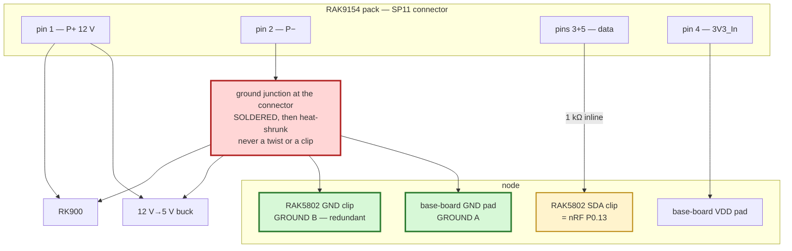
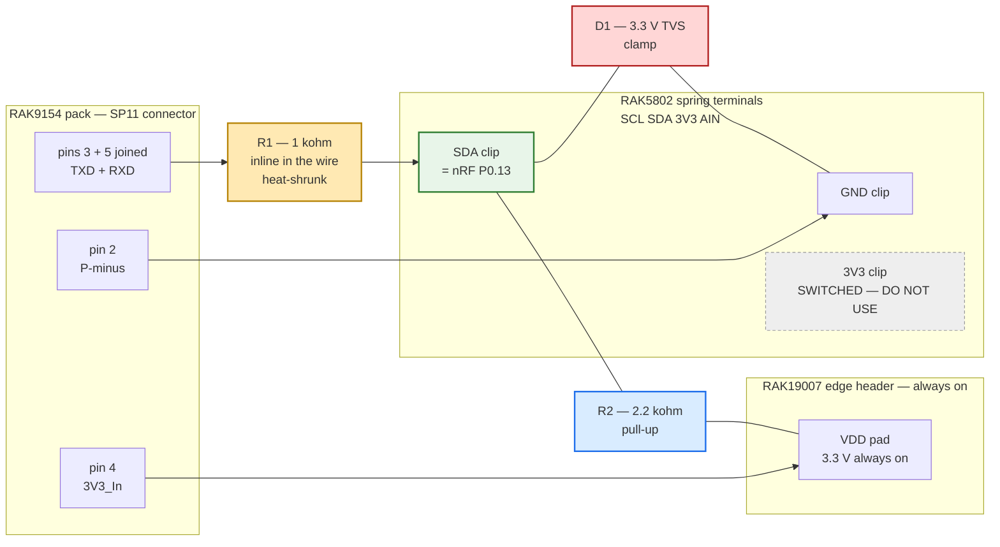

# Hardware — WisBlock RK900 + RAK9154 node

🚧 **NOT YET BUILT.** Bench/field status: none.

Authoritative behavior: [`FIRMWARE_SPEC.md`](FIRMWARE_SPEC.md). Libraries: [`LIBRARIES.md`](LIBRARIES.md).
Numbered assembly procedure: [`BUILD.md`](BUILD.md).

This file holds research, evidence context, and electrical rationale. Its historical diagrams are
not build instructions.

## Mission

Class A LoRaWAN US915 end node: poll **RK900-09** + **RAK9154**, uplink on downlink-settable interval, woods-hardened.

## BOM (ordered path)

| Role | Part | SKU |
|---|---|---|
| Core | RAK4631 US915 | **116000** |
| Base | RAK19007 | **110082** |
| RS-485 | RAK5802 | **100003** |
| Antenna | Blade 915 RP-SMA (if needed) | **926019** |
| Enclosure | Unify **solar** variant — the no-solar 910406 was out of stock | **910421** (confirm) |
| Buck | 12 V → 5 V | (separate) |
| Power source | RAK9154 Solar Battery Lite, **large-panel variant** | — |

**Not used:** RAK13002 (conflicts with 5802 IO slot), GNSS, RTC, AS923 kit **119012**.

### The enclosure that arrived has its own solar panel — and we do not want to use it

Planning assumed the no-solar 910406. Only the solar variant was available, so the shell in
hand has panel mounting and, unlike 910406, is roomy enough for the buck converter with
space to spare. Both of those are fine. The panel is the problem, and it is a decision
rather than a detail:

**The RAK9154 must remain the power source, and the enclosure's panel should be left
unconnected.** Half the firmware exists to read that pack — voltage, current, state of
charge, and temperature come over the one-wire link on its 5-pin socket
([ADR-0004](decisions/ADR-0004-bms-one-wire-path.md)), the low-voltage gate in
`src/power.h` decides whether to transmit based on what it reports, and four of the nine
uplink fields come from it. Powering the node from the enclosure panel instead would mean
no pack to interrogate: `BatteryReading` would be permanently absent, the brownout gate
would have nothing to act on, and the node would lose the ability to tell anyone it was
running out of energy.

Wiring both panels into the pack's charge input is also not the answer — the RAK9154 has
its own 18 V charge controller expecting one array, and a second uncontrolled source on the
same input is a good way to damage it.

So the enclosure's panel is dead weight here. That is acceptable; it was a stock
substitution, not a design change. Do not "make use of it" without revisiting this.

**The RAK9154 is solar-recharged in its own right:** 56.16 Wh pack, integrated 18 V charge
controller, BMS, and heater, with a 10 W panel in the regular variant [CIT-RAK9154-SOLAR].
This deployment uses the large panel. The system was always solar; only the shell was not.
This was previously stated wrong in [`POWER_BUDGET.md`](POWER_BUDGET.md) and matters a great
deal to the design — see that page.

**To confirm on the bench:** the exact SKU, how many cable entries the shell actually has,
and whether the lid panel terminates in a bare lead or a connector. Cable entry planning is
issue #20 and the premise changed with the shell.

**Select the buck on its no-load quiescent current.** It is a 24/7 load in parallel with
everything the firmware does, and a part drawing several milliamps at idle would exceed the
node's entire average draw on its own.

## RAK9154 ports (critical)

The pack has **two** load sockets. Connector reference:
`forest-weather-machines/rak-4-5-wire/docs/01-connector-reference.md` [CIT-RAK45WIRE] —
the sibling repo is cloned at `~/Documents/GitHub/forest-weather-machines`, not beside this
repo, so it is cited rather than linked. See [`CITATIONS.md`](CITATIONS.md).

### A — 4-pin Gateway Load (SP11/P4) — BMS Modbus — **fallback only**

Superseded by [ADR-0004](decisions/ADR-0004-bms-one-wire-path.md): the battery uses the
one-wire path on socket B. This socket stays unused and available if one-wire proves
unreliable on the bench.

| Pin | Signal |
|---|---|
| 1 | P+ (~12 V) → buck only |
| 2 | P− → GND |
| 3 | RS-485 A |
| 4 | RS-485 B |

Modbus slave **0x6E**, **9600** 8N1. Register map: FIRMWARE_SPEC §2.2 / RAK2560 settings §5d.

### B — 5-pin Sensor Hub Load (SP11/P5) — power + one-wire — **chosen**

**Mating part: `SP1110/P5-N` plug** (SP11 series, IP67, screw-locking circular, 2 A, 0.75 mm
contacts × 5). The socket on the pack is `SP1110/P5`; the cable-end plug that mates with it is
the `-N` variant [CIT-RAK9154]. Buying the plug is preferable to cutting the supplied cable,
which keeps the assembly weatherproof and reversible.

The connector visible **inside** a Sensor Hub shell is the board-side end of that bulkhead and
is a different, unpublished part — RAK does not document it, so it cannot be ordered by part
number. Measure the pin pitch before assuming a JST family (1.0 mm SH, 1.25 mm GH, 1.5 mm ZH,
and 2.0 mm PH all look alike in a photograph). Mating it saves a gland but ties the build to an
undocumented part.

| Pin | Signal | Notes |
|---|---|---|
| 1 | P+ (~12 V) | Splits two ways: buck VIN+, **and** the RK900's 12 V supply |
| 2 | P− | GND — shared return for the buck, the RK900, and the RS-485 reference |
| 3 | TXD | Half-duplex data (bridge to pin 5 for one-wire) |
| 4 | 3V3_In | Level ref / probe rail — tie carefully to 3V3, **never 5 V** |
| 5 | RXD | Bridge to TXD for one-wire |

**Not** full-duplex UART to RX1/TX1 as two independent lines without bridging — Hub protocol is half-duplex one-wire @ 9600. See Meshtastic / RAK-OneWireSerial / `rak-4-5-wire`.

## RAK5802 terminal blocks — what each one actually is

Two 4-way spring terminals, silkscreened `BAT GND A/RX B/TX` and `SCL SDA 3V3 AIN`. Eight clips
total. **Six of the node's seven external connections land in them**, which is why the build below
uses this module as the wiring hub rather than the base-board header.

| Block | Clip | What it is | What this node puts in it |
|---|---|---|---|
| 1 | `BAT` | battery rail **output**, 2.6–4.2 V, for powering a sensor [CIT-RAK5802] | *empty* |
| 1 | `GND` | common ground — same net as the base-board `GND` pad | pack pin 2 (`P−`) |
| 1 | `A/RX` | RS-485 A, non-inverting | RK900 `A` |
| 1 | `B/TX` | RS-485 B, inverting | RK900 `B` |
| 2 | `SCL` | I²C clock, an otherwise unused GPIO | *empty* |
| 2 | `SDA` | **nRF P0.13 — the one-wire pin**, direct passthrough, no buffer | pack pins 3+5 joined |
| 2 | `3V3` | **switched** output on `3V3_S` — dies mid-cycle | *empty. never use* |
| 2 | `AIN` | one analog input | *empty* |

Each clip takes **one** conductor. `P−` has to fan out to the buck negative and the RK900 negative
as well, so that junction is made at the pack connector and a single wire runs from it to `GND`.

**`BAT` and `3V3` are outputs to power a sensor, not supply inputs.** Neither can run the RK900,
which needs 12 V — that comes from the pack, through the buck, and never through this module.

**Do not take the pack's `3V3_In` (pin 4) from the RAK5802's `3V3` terminal.** That terminal sits
on `3V3_S`, which `WB_IO2` switches, and `src/sensors/rk900.cpp` deliberately drops `WB_IO2` LOW
when it finishes reading the weather station in order to power the transceiver down. The battery
is read *after* the weather station, so the pack's reference would be dead exactly when it is
needed, and the symptom would be a battery that never replies — easy to misread as a wiring or
protocol fault. Take pin 4 from the always-on `VDD` pad on the base-board header instead.

## RK900

4-wire: V+, GND, A, B → RAK5802 @ **9600**, slave `0x01`. Probe IO optional as junction box
only. The datasheet and the one field-deployed twin both say 4800; **this physical unit
answers only at 9600** and gives zero bytes at 4800 across four consecutive sweeps
([ADR-0006](decisions/ADR-0006-rk900-baud-and-register-map.md), 2026-08-03, `998dc26`).
Wiring from 4800 costs a bench session debugging a bus that is silent by configuration.

## P0 wiring — decided

Per [ADR-0004](decisions/ADR-0004-bms-one-wire-path.md). The two sensors are on **separate
buses**, so neither can interfere with or block the other.

### The two power rules, stated plainly

> **12 V positive (`P+`) goes to BOTH the buck VIN+ AND the RK900's 12 V input.**
>
> **12 V negative (`P−`) goes to the buck negative and RK900 negative, plus two independent node
> returns: the base-board `GND` pad and the RAK5802 `GND` clip.**

The two node-return conductors are a mitigation against one connection becoming intermittent.
No ground interruption was captured on this node, so this requirement does not establish the
failure mechanism.

Both rails split. Nothing is daisy-chained through the RAK5802, and nothing is exclusive.

### The two data rules, stated plainly

> **Pack pins 3 and 5 (TXD and RXD) are joined in the historical harness. The resulting data
> line must not reach `SDA` until the powered-off isolation and contention gates below close.**
>
> **Pack pin 4 (`3V3_In`) goes to the `VDD` pad on the base board. Not to the RAK5802's `3V3`
> terminal, and never to 5 V.**

Both pads are on the 2.54 mm header along the edge of the RAK19007, silkscreened
`BAT IO2 IO1 A1 IN1` and `SDA SCL TX1 RX1 GND VDD BOOT0`. Neither signal appears on any screw
terminal, so both are solder joints.

### Qualifying the pack harness — measure the data line before it touches a pad

**Answered 2026-08-30 — the pack is not the overvoltage source.** For the whole life of this
project the data-line level was an assumption: 3.3 V, because pin 4 is *labelled* `3V3_In`. It is
now a measurement ([`EVIDENCE.md`](EVIDENCE.md), capture 13, 2,347,642 samples over 60.1 s, no
Core in the loop):

| Property | Measured | Against |
|---|---|---|
| Idle / HIGH | **+3.3118 V** | pad max `VDD + 0.3 V` = **3.600 V** [CIT-NRF-GPIO] |
| Driven LOW | **+0.0867 V** | pad min **−0.300 V** |
| Absolute peak | **+3.318 V** | **282 mV of headroom** |
| Absolute floor | **+0.014 V** | no negative excursion across 9,520 edges |

**What this capture establishes:** with pin 4 held at the measured +3.291 V, the pack data HIGH
was +3.3118 V — 21 mV apart, one rail within the analyzer's 4.88 mV LSB. Across this 57.11 s
capture the pack did not exceed a powered nRF52840 pad's voltage limits. This is a result for the
captured pack-side condition, not a general clearance of the base board, connector transitions,
or the MCU-side driver.

**Two things the same numbers do *not* clear:**

- The pack is an **active low-side driver** (+0.0867 V, not a passive pull-down), so a transmit
  overlap is two live drivers in opposition, and our end idles push-pull HIGH
  ([#99](https://github.com/disruptivepatternmaterial/rak-sensor-node-but-better/issues/99)).
- The line idles at **+3.31 V** while an *unpowered* pad's maximum is **0.3 V**
  [CIT-NRF-BACKPOWER] — **11× over** whenever the harness is mated to a dark core. That is the
  connector-sequencing rule below, and it is now measured rather than assumed
  ([#101](https://github.com/disruptivepatternmaterial/rak-sensor-node-but-better/issues/101)).

**Nine pads remain electrically unexplained — but not unattributed.** Every one of them was running
diagnostic firmware the operator never authorized, written and flashed by agents over SSH across
multiple sessions. Zero pads have been destroyed by the production image
([#102](https://github.com/disruptivepatternmaterial/rak-sensor-node-but-better/issues/102)). What
follows is how the above was measured, and how to re-qualify any replacement harness or pack. It
risks no silicon.

**Why the analyzer and not a core:** the failure being tested for is overvoltage, and the two
instruments have wildly different tolerance for it.

| Instrument | Absolute maximum input | Loads the line with |
|---|---|---|
| nRF52840 GPIO pad, powered | `VDD + 0.3 V` ≈ 3.6 V [CIT-NRF-GPIO] | an ESD clamp diode |
| nRF52840 GPIO pad, unpowered | **0.3 V** [CIT-NRF-BACKPOWER] | an ESD clamp diode |
| Saleae Logic Pro 8 | **−25 V to +25 V** [CIT-SALEAE-LOGICPRO8] | 2 MΩ ∥ 10 pF |

The analyzer tolerates roughly seven times what the pad tolerates and presents 2 MΩ, so it cannot
meaningfully load the pack's measured 15 kΩ pull-down. It reads the answer without spending a
core. Its analog range saturates at +10 V, so a reading pinned at 10 V still convicts — it means
"at least 10 V", which is already three times the pad's limit.

**The obvious version of this test does not work, and it was measured failing.** Probing the data
wire with the harness fully unplugged from the node returns **0.000 V, dead flat** — measured
2026-08-30, 786,429 samples over 20.1 s, 0.74 mV of noise, 98.6 % of samples on one ADC code
([`EVIDENCE.md`](EVIDENCE.md)). That is not a floating clip; it is 105× quieter than this
analyzer's open-probe baseline, so it is a genuine low-impedance tie to ground.

It reads 0 V for a structural reason: **the pack's data-line reference is its own pin 4
(`3V3_In`), and pin 4 is fed *from the node*.** Unplug the node and the pack's driver has no
rail, so the line rests at 0 V through the pack's measured 15 kΩ pull-down — whether the harness
is lethal or benign. So the measurement named in
[#102](https://github.com/disruptivepatternmaterial/rak-sensor-node-but-better/issues/102)
cannot convict or clear anything, and a 0 V result must never be recorded as a cleared harness.

**Setup that produced the valid result — energise pin 4, expose no pad.** Use the
current-limited bench supply configuration recorded with capture 13 in
[`EVIDENCE.md`](EVIDENCE.md). Do **not** substitute a powered, coreless RAK19007: the RAK19007
datasheet says the edge-header `VDD` is generated by the Core, so a coreless base board is not a
documented 3.3 V source [CIT-RAK19007-DS].

| Item | State |
|---|---|
| RAK4631 Core | **removed from the base board** — this is what makes the test free |
| Base board | **not in the measurement loop** |
| Bench supply | 3.3 V, 50 mA current limit; negative bonded to pack pin 2 |
| Pack pin 4 (`3V3_In`) | bench-supply positive |
| Joined data wire (pins 3+5) | **to the analyzer only — not to `SDA`** |
| Analyzer channel 0 | the joined data wire |
| Analyzer `GND` | pack pin 2 (`P−`) |
| Pack | powered |

Ground on the **pack's own** return, not the node's, because the question is what the pack
presents relative to its own reference. The analyzer takes ±25 V; no Core or base-board GPIO is
in this measurement.

**Reading the result.** `scripts/owprobe.py <analog.csv>` applies the table below to a Saleae
analog export and exits 0 (within a powered pad's rating), 2 (out of spec — do not connect a
core), or 1 (the capture is not evidence, e.g. a floating clip). It refuses to clear a harness
from a capture that never leaves the open-probe noise band, because a disconnected probe and a
healthy line at 0 V are indistinguishable, and reading one as the other is how a core dies.

| Idle level, data wire to pack `P−` | Verdict |
|---|---|
| **0 V, flat, under 20 mV of noise** | **Not an answer.** The pack's reference is not energised — pin 4 has no supply. Fix the setup above and re-run. Never record this as cleared. |
| 0 V, but over 20 mV of noise | The probe is not on the wire, or the ground lead is not on the pack's return. |
| ≤ 3.3 V | Harness cleared as an overvoltage source. #102 stays open; move to the next candidate. |
| 3.6 V – 5 V | Out of spec. Every connection has been overstressing the pad. Needs a level translator, not a resistor. |
| > 5 V, or saturated at +10 V | **This is the pin killer.** Do not connect another core to this harness. |
| swinging below 0 V | Ground-offset or undershoot path — the direction that matches the measured short-to-ground signature. Capture the transient before concluding. |

The last row is the one only an analyzer can answer. A meter averages a transient undershoot away;
a 781.25 kS/s analog capture shows it. That matters because every dead pad here reads short to
**ground**, which is the *lower* clamp's failure direction, and no mechanism proposed so far
predicts that.

Record the number, the date, and the raw capture path in [`EVIDENCE.md`](EVIDENCE.md). A verdict
with no number attached is how this got to nine pads.

### Authoritative pre-Core gate — stop here

**Do not connect a Core to this one-wire harness.** Nine GPIO pads have been destroyed, every one
while carrying this data line, and the mechanism is not established
([#102](https://github.com/disruptivepatternmaterial/rak-sensor-node-but-better/issues/102)).
The production image has destroyed none; that observation does not clear the electrical design.

This is the only current build gate. Later schematics in this section describe the intended
topology or candidate mitigations; they are not permission to install a Core.

| Gate | Evidence now | State |
|---|---|---|
| Pack-side voltage with its reference energised and no Core present | Capture 13: +0.014 V to +3.318 V over 57.11 s | **PASS for captured pack-side overvoltage only** |
| Base-board `BAT` isolation from `IO1`, `A1`, and `SDA`, Core removed | Operator meter: open/overload; recovered in `EVIDENCE.md`; base board not identified | **OBSERVED; identity/raw meter record incomplete** |
| Two independent ground paths from pack pin 2 to the node | Required mitigation below; no completed-node continuity record | **OPEN** |
| Powered-off isolation between pack data and the nRF52840 pad | Candidate part researched below; no circuit built or measured | **OPEN** |
| MCU-side/pack-side voltages during a production transmission | No two-sided capture exists | **OPEN** |

An open gate stays open. Do not turn a calculation, datasheet feature, or result from another
device into a pass.

#### Background — hypotheses, not build instructions

**CAUSE NOT ESTABLISHED. This section previously claimed it was, and that claim was wrong.**

In every observed failure the dead pad was the one carrying the pack's data line. That correlation
is solid. The mechanism is not.

Three things refute the explanation that used to stand here:

- **The pads fail shorted to *ground*.** Back-powering conducts through the pad's *upper* ESD
  diode, which would leave a pin shorted to *VDD*. Nordic's own thread raises this objection and
  leaves it open [CIT-NRF-PINSHORT]. Every pad measured here reads short to ground.
- **A 1 kΩ series resistor was inline when `SDA`/P0.13 died.** The current-limiting argument below
  predicted that would be survivable. It was not.
- **Node 002's harness has been replaced three times**, so the harness is not the constant, and
  `src/sensors/battery.cpp` is unchanged since the image running without incident on node 001 —
  so no firmware difference explains it either.

The sequencing rule below is still worth following, and the reasoning that produced it is
recorded here because it is sound physics even though it has not been shown to be *this* failure.
What it is **not** is a proven fix.

Nordic states the limit and the consequence [CIT-NRF-BACKPOWER]:

> "Max voltage on any GPIO is VDD + 0.3 V. Meaning that for an **unpowered** device, max GPIO
> voltage is **0.3 V**. Any voltage above this level will make the ESD protection diode conduct and
> you will backpower the device via the GPIO."

The pack idles its data line at a level referenced to `3V3_In` and has no idea whether the core is
powered. So an unpowered core with the harness mated sees ~3.3 V on a 0.3 V maximum, and the
current goes in through the pad's ESD diode. Nordic's word for the result is "the high current flow
can permanently damage the pin" [CIT-NRF-PINSHORT]. The measured signature here is ~3.9 Ω to
ground — note again that this is the *wrong direction* for that mechanism, which is the single
strongest reason not to treat it as settled.

**The one difference between the two nodes that survives scrutiny:** the buck powers the core
*through the USB-C connector*, so the buck and a host cable are mutually exclusive. Every swap
between bench and pack power therefore contains a window with the core dark and the harness mated.
Node 002 went through that window a dozen times in one day of bring-up. Node 001 was wired once
and deployed, and has never been through it.

That makes the bench procedure the best-supported remaining suspect — the pack itself being the
other, since 002's pack has never been swapped. Both are untested. Neither is a conclusion.

### Redundant-ground mitigation — not the established cause

Ground loss is one mechanism consistent with a pad carrying unintended return current. It has not
been observed on this node and is not established as the cause.

Every dead pad reads short to **ground**. Nordic's own engineers hit this exact signature on this
exact chip and state that it requires one of only two conditions — and note that back-powering
gives the *opposite* result:

> "If diode current would be exceeded it could short SWDIO **to VCC and not to GND** which happens
> in our cases... We were unable to figure out how **a negative voltage could be applied to the
> SWDIO pin (or ground lifted above SWDIO)**"

[CITE(prior-art): Nordic DevZone 73811 — nRF52840 pins failing short to GND, and the direction problem stated by Nordic](https://devzone.nordicsemi.com/f/nordic-q-a/73811/swdio-pin-shorted-to-ground)

And there is a documented cause with precisely that shape, for UART pins between two boards on
this same part:

> "Poor connections between the PCBs and the cable, **especially the GND pin. If the GND pin
> becomes disconnected, then the entire current consumed by the nRF52840 has no other way but the
> TX/RX pins.** Again, the connectors may be good enough to pass your test, but will fail in the
> environment due to vibration."

[CITE(prior-art): electronics.stackexchange 661745 — ground loss makes a data pin the chip's return path, and the redundant-ground remedy](https://electronics.stackexchange.com/questions/661745/possible-esd-damage-on-uart-pins-between-nrf52840-and-atmega1284p)

**If the ground return is interrupted while another conductive path remains through the data
line, current can return through the data pin.** The cited prior-art failure demonstrates that
mechanism on an nRF52840 design; it does not prove that this node lost ground.

The same source names the fix, and it is not a resistor:

> "running the GND via **both pin 1 and pin 8** of the cable will help. This configuration would
> ensure that **GND is the first line to make contact (or the last line to lose contact)** even if
> the connector becomes tilted sideways."

So: **two independent ground conductors, and ground that mates first and breaks last.**



**Two green paths, not one.** `GROUND A` and `GROUND B` are separate wires from the junction to two
separate points on the node. Losing either one leaves the other carrying the return, so the data
pin never becomes the backup.

The junction is therefore treated as a safety-critical candidate path. It must be **soldered and
heat-shrunk**, never a twist or a spring clip alone. This is mitigation, not attribution.

### Ground assembly requirements — not Core-installation authorization

Ground first, ground last. No exceptions, no shortcuts, and never two power sources at once.

**Building a node from parts:**

1. Make the pack-side ground junction: pack pin 2, buck negative, RK900 negative, and **two**
   separate wires for `GROUND A` and `GROUND B`. **Solder it. Heat-shrink it.**
2. Land `GROUND A` on the base-board `GND` pad.
3. Land `GROUND B` in the RAK5802's `GND` spring clip.
4. **Verify both grounds before anything else:** meter continuity from pack pin 2 to the base-board
   `GND` pad, then to the RAK5802 `GND` clip. Both must read a dead short. If either is open or
   intermittent, stop — this is the failure that costs pads.
5. Pack pin 4 → base-board `VDD` pad.
6. Pack pin 1 → buck input positive, and → RK900 12 V.
7. RK900 `A` and `B` → RAK5802 `A/RX` and `B/TX`.
8. Pack data (pins 3+5 joined) → 1 kΩ inline → RAK5802 `SDA` clip. **This wire goes on last.**
9. Qualify the pad before trusting it, **with a meter and with the board powered down**: measure
   its resistance to ground and compare against a known-good pin on the same core. Hundreds of kΩ
   is healthy; a few kΩ means the pad is already gone. Do not proceed on a damaged pad, and do not
   use firmware to check — the diagnostic that did this was deleted for destroying pads.
10. Stop at the pre-Core gate above. Do not install a Core or apply power through the completed
    one-wire path while any gate remains open.

**Switching a built node from pack power to bench USB:**

1. **Unmate the pack connector.** First. Always.
2. Remove buck power.
3. Plug in host USB.

**Switching from bench USB back to pack power:**

1. Unplug host USB.
2. Connect the buck.
3. Confirm the boot banner.
4. **Mate the pack connector last.**

**Never do these:**

- Never have the host USB cable connected while the pack is mated. The buck feeds the core through
  the USB-C connector, so the two supplies are mutually exclusive by design — and every node that
  has lost a pad was repeatedly put in this state, while node 001, which never has been, is intact.
- Never hot-plug the pack connector on a live node. On a mating connector the pins touch in an
  unpredictable order, and wire inductance during the plug can break down the clamp diode by itself
  [CIT-NRF-UNPOWERED-PIN].
- Never move the data wire to a fresh pad without running the census in step 9 first.

### Powered-off isolation candidate — researched, not yet cleared to build

The direct `SDA` passthrough does not satisfy the powered-off-pad limit: the nRF52840 GPIO maximum
is 0.3 V when its `VDD` is 0 V [CIT-NRF-BACKPOWER]. TI's powered-off-protection guidance requires
a switch whose own datasheet specifies I/O isolation with its supply at 0 V
[CIT-TI-POWERED-OFF-SWITCH].

`SN74CBTLV1G125` is the current candidate [CIT-SN74CBTLV1G125]:

- one bidirectional 1:1 FET switch; no fixed TX/RX direction;
- `Ioff` maximum 10 µA with `VCC = 0 V` and either data terminal from 0 V to 3.6 V;
- 5 Ω typical on-resistance and 10 µA maximum supply current at 3.6 V;
- active-low output enable; TI requires a pull-up from `OE` to `VCC` so the path stays
  high-impedance during power-up and power-down.

The candidate topology powers the switch from the Core-side `VDD`, places its bidirectional data
path between the pack and `SDA`, and defaults `OE` to disabled. This is a **candidate**, not a
wiring instruction. It solves one established hazard—voltage reaching an unpowered pad—but its
low on-resistance does not limit two powered transmitters fighting.

It becomes an approved design only after all of these exist:

1. an exact schematic naming the `OE` control source and pull-up value;
2. a contention-current limit that still meets the measured HIGH/LOW thresholds at 9600 baud;
3. a no-Core test showing the Core-side switch terminal remains isolated while the pack side is
   active and switch `VCC` is 0 V;
4. powered captures on both sides of the current-limiting element during the production exchange;
5. sleep-current accounting for the finished circuit.

`TMUX1101` was considered and rejected: its datasheet provides fail-safe protection for the
control input, not powered-off isolation on the signal path. `TMUX1511` does provide signal-path
powered-off protection, but it is a four-channel, 70 µA-maximum part where this node needs one
channel. Neither rejection is a claim that the part is defective; it is a fit decision from the
manufacturers' specifications.

### The one-wire series resistor — mitigation only

**This section used to be titled "REQUIRED — the one-wire protection network" and claimed the
series resistor "actually saves the pin". A 1 kΩ resistor was inline when `SDA`/P0.13 died, so
that claim is refuted by measurement and has been removed
([#102](https://github.com/disruptivepatternmaterial/rak-sensor-node-but-better/issues/102)).**

The reasoning was: Nordic's damage mode is **current** through the ESD diode rather than voltage
across it [CIT-NRF-BACKPOWER], a bare wire limits that current only by the diode's own resistance,
and 1 kΩ bounds it to roughly 3 mA. That arithmetic is still correct. What it evidently does not
cover is whatever actually killed these pads — which is consistent with the failures being short
to ground rather than the back-powering the arithmetic was aimed at.

Retain 1 kΩ in any test fixture because it bounds current relative to a bare wire. It is not the
approved value for a finished node: the two-sided capture needed to select that value has not
been run. A fitted resistor does not close the pre-Core gate.

| Ref | What | Value | Suggested part |
|---|---|---|---|
| **R1** | resistor | 1 kΩ, ¼ W | any through-hole 1 kΩ |

#### Unvalidated companion parts

These parts appeared in an earlier proposed network. Neither closes powered-off isolation or
contention, and neither is authorization to connect a Core.

| Ref | What | Value | Suggested part | What it adds |
|---|---|---|---|---|
| **R2** | resistor | 2.2 kΩ, ¼ W | any through-hole 2.2 kΩ | pulls the idle level clear of the 1.7 V grey zone the pack's 15 kΩ pull-down creates. **Must reference the board's own `VDD` pad, never an external rail** — a pull-up to an external supply back-powers the nRF through the pin when the board is off [CIT-PARTICLE-BACKPOWER] |
| **D1** | 3.3 V bidirectional TVS / ESD diode | 3.3 V working voltage | Nexperia `PESD3V3L1BA`, Littelfuse `PESD3V3S1UB`, any 3.3 V TVS | clamps a spike faster than R1 alone can bleed it |

A **bidirectional** TVS has no polarity, so it cannot be fitted backwards — that is why it beats a
`BAT54S` here. Check the part's own datasheet for its **working** voltage, not its breakdown
voltage, before fitting.

#### Where it lands — use the RAK5802 spring terminals, not the soldered pad

`WB_I2C1_SDA` is P0.13, and `variant.h` marks it `SENSOR_SLOT IO_SLOT` — so it appears **both** on
the base-board edge header **and** on the RAK5802's second spring terminal block, silkscreened
`SCL SDA 3V3 AIN`. RAKwireless documents that block as a "reserved I2C expansion interface", a
direct passthrough with no buffer or isolation; the module's 18 kV ESD protection is on the RS485
side only [CIT-RAK5802].

**Land the pack's data wire in the RAK5802's `SDA` spring terminal.** It is the same net as the
pad, and it is better in three ways: no soldering, trivial rework, and it keeps you entirely off
the 2.54 mm header row where all seven dead pads have been.

> **Trap — do not use the RAK5802's `3V3` terminal for anything.** That terminal sits on the
> switched `3V3_S` rail, and `src/sensors/rk900.cpp` deliberately drops `WB_IO2` LOW after each
> weather read. A pull-up or a reference taken from there vanishes partway through every cycle,
> and the symptom is a battery that reads intermittently — very easy to misread as a protocol
> fault. R2 and pack pin 4 both come from the always-on **`VDD` pad** on the edge header.

`GND` on the same terminal block is common ground and is fine for D1 and for the harness ground
wire.

#### Historical unisolated topology — do not build

The diagrams below document the topology used for the measurements and failures. They omit the
powered-off isolation switch and are **not** current build instructions.



The same thing as a plain schematic, because the boxes above hide the topology:

```
 pack pin 3 ─┐
             ├─ (joined) ── R1 1 kohm ──┬────────── RAK5802 "SDA" spring clip  (nRF P0.13)
 pack pin 5 ─┘                          │
                                        ├── R2 2.2 kohm ──── VDD pad  (edge header, always on)
                                        │
                                        └── D1 TVS ───────── RAK5802 "GND" spring clip

 pack pin 2 (P-minus) ───────────────────────────────────── RAK5802 "GND" spring clip
 pack pin 4 (3V3_In)  ───────────────────────────────────── VDD pad  (edge header)

 RAK5802 "3V3" clip ── UNUSED. Switched rail, dies mid-cycle.
```

**R1 is the only thing between the pack and everything else.** D1 and R2 both attach on the
board side of R1. That ordering is the design: R1 limits the current, then D1 and R2 protect and
bias a node R1 has already made safe.

#### Historical whole-node picture — do not build

Solid lines are spring clips. The single dashed line is the one solder joint.


Read it as five wires out of the pack:

| Pack pin | Goes to | How |
|---|---|---|
| 1 `P+` 12 V | buck `VIN+` **and** RK900 12 V | never touches the RAK5802 |
| 2 `P−` | buck `VIN−`, RK900 `GND`, and the `GND` clip | junction at the connector, one wire to the clip |
| 3 + 5 joined | `SDA` clip, through R1 if fitted | **the one-wire link** |
| 4 `3V3_In` | `VDD` pad | **the only solder joint** |

Plus the RK900's own two data wires, `A` → `A/RX` and `B` → `B/TX`.

#### Build steps

There is no complete-node build sequence while the pre-Core gate is open. The earlier sequence
was removed because it contradicted the redundant-ground requirement and authorized a direct,
unisolated GPIO connection. Current work stops after the no-Core measurements and candidate
interface validation listed above.

### Open measurement detail

The authoritative STOP is the pre-Core table above. This section records why its remaining
measurements matter; it does not create a second build sequence.

**This line has been instrumented, and the pack side is cleared.** Do not read the stop above as
"nothing is known". Measured 2026-08-30 with the Saleae Logic Pro 8 ([`EVIDENCE.md`](EVIDENCE.md)):
the pack actively drives its end at **+3.3118 V idle** and **+0.0867 V driven low**, with **9,520
edges in 57 s** — never out of pad spec, and with no 12 V bridge to the data line anywhere in the
harness. The announcement frame was decoded off the wire at 9600 8N1. The pack alone is harmless.

**Nor is the harness the sole suspect.** `A1` died against two different harnesses *and* with the
harness removed entirely and the RAK5802 pulled, and node 001 — same parts order — reads its pack
on `IO1` in the field and is alive. What correlates is the pad carrying this data line, not any one
harness.

**The missing powered measurement is our own end while transmitting:** an analyzer channel on
each side of the series element during a production exchange. Their measured voltage difference,
divided by the measured resistance, yields current. It requires an active transmitter on the
Core side; no replacement Core is authorized for that role while the preceding protection gates
remain open. No current threshold is asserted before the circuit and the applicable device limits
are selected.

**There is no firmware pad census, and there must not be one.** `env:owscan*`,
`FEATURE_ONEWIRE_SCAN` and `src/diagnostics/owscan.*` were deleted on 2026-08-30 after GPIO
pads were destroyed across two cores — every one of them the pad carrying this data line. A
firmware census structurally cannot answer this question safely, because reaching a pad means
driving it, and the census drove it at 14x the production rate with the worst-case bit pattern.
Two multimeter readings settled in one minute what it got wrong across several sessions and
several discarded cores.

Use the meter for "is this pad usable", and the Saleae Logic Pro 8 for "what is on this wire" —
±25 V absolute maximum and a 2 MΩ input, against a pad rated 3.6 V powered and **0.3 V
unpowered**. See [`../AGENTS.md`](../AGENTS.md) and
[`../.cursor/rules/05-never-instruct-an-unmeasured-connection.mdc`](../.cursor/rules/05-never-instruct-an-unmeasured-connection.mdc).

#### What the historical parts did—and did not establish

| Part | Job |
|---|---|
| **R1, 1 kΩ** | Limits current relative to a bare wire. It was present when `SDA`/P0.13 died, so it is not established protection for this failure (#101). |
| **D1, proposed TVS** | Never validated in this circuit. No claim is made that it makes a 12 V fault survivable. |
| **R2, proposed pull-up** | Never validated in the final circuit. Its interaction with the pack's measured line behavior and the isolation switch remains part of circuit selection. |

No RC or signal-integrity claim is made without a measured harness capacitance and a finished
circuit.

#### Two habits that go with it, both free

- **Never mate or unmate the pack connector with the board powered.** SP11 pins do not mate
  simultaneously, so a powered hot-plug can leave the data line referenced to nothing for a
  moment. Order: unplug USB, unmate pack, work, mate pack, plug in USB.
- **Meter every new core before it goes into a baseboard** — `IO1` to `GND` on the core connector,
  expect megohms. A few ohms means it arrived shorted, so send it back. No core's `IO1` has ever
  been measured *before* installation, which is exactly why "arrived shorted" cannot be told apart
  from "shorted here."

#### Failure attribution

No component list exonerates the harness or Core by construction. Attribution requires the
before/after electrical measurements and captures named in the pre-Core gate.

### Intended harness after the electrical gate closes

| From (pack, 5-pin SP11) | To | Why |
|---|---|---|
| Pin 1 `P+` (~12 V) | buck VIN+ **and** RK900 12 V | both, in parallel |
| Pin 2 `P−` | buck negative **and** RK900 negative **and** the base board `GND` pad | all three |
| Pins 3 + 5 joined | isolation/current-limiting network **not yet finalized**, then `SDA` (`WB_I2C1_SDA`, nRF P0.13) | one-wire half-duplex; blocked by the pre-Core gate |
| Pin 4 `3V3_In` | `VDD` pad | always-on 3.3 V reference |

`IO1` was the original one-wire pad and `A1` replaced it. `SDA`/P0.13 is the intended firmware
mapping, and node 002 previously read 12.43 V, -0.01 A, 100 %, 24.0 C over SDA on
2026-08-30 across nine cycles in two sessions, and the field image's uplink landed at TTN
(`f_cnt 832`) ([`EVIDENCE.md`](EVIDENCE.md)). Build such a node from `env:rak4631_sda`, with
`env:battdiag_sda` for fast pack questions — **but not until the harness is cleared under
[#102](https://github.com/disruptivepatternmaterial/rak-sensor-node-but-better/issues/102)**.
Historical function does not establish electrical safety.

**Qualify the pad before you solder to it — with a meter.** SDA was originally selected on a
firmware census, and that census is now deleted: it drove the pad it was measuring and is the
common factor in seven destroyed pads. Qualify a pad by metering its resistance to ground while
powered down and comparing it against a known-good pin on the same core. A1 was chosen by decision
rather than measurement, and that is part of what made 2026-08-30 expensive — but the answer to
that is a meter, not a diagnostic image.

Why the moves happened, and what is still unknown: three cores have shown `IO1` shorted to ground
(~3.86 ohm, 2026-08-29), and on 2026-08-30 node 002's core also lost `A1` — held 100 % low against
the internal pull-up with two different harnesses and with the harness removed entirely, and with
the RAK5802 pulled. On the same core `A0` and `SDA` read idle HIGH, so the instrument is sound and
the dead pads are real.

**No mechanism has been established.** Six hypotheses were tested and refuted or weakened on
2026-08-30 — driver contention, ground float, a 5 V `VDD`, a miswired harness, a slot module
holding IO1, and ESD. The pack is cleared as an overvoltage source by measurement: its data line
reads **20 mV** and **15 kohm** to pack minus with the wire off the board. Node 001, from the same
parts order, reads its pack on `IO1` in the field. See
[#102](https://github.com/disruptivepatternmaterial/rak-sensor-node-but-better/issues/102),
[#96](https://github.com/disruptivepatternmaterial/rak-sensor-node-but-better/issues/96) and
[#99](https://github.com/disruptivepatternmaterial/rak-sensor-node-but-better/issues/99).

Two rules that follow, both cheap:

- **Incoming test every core before it goes in a baseboard** — `IO1` to `GND` on the core
  connector, expect megohms. No core's IO1 has ever been measured *before* installation, which is
  exactly why "arrived shorted" cannot be told from "shorted here."
- **Never mate or unmate the pack connector with the board powered.** Pins on the SP11 do not
  mate simultaneously.

That 15 kohm pack pull-down also means the idle line sits near 1.7 V against the nRF52840's ~13
kohm internal pull-up, inside the undefined band between V_IL and V_IH. An external 2.2-4.7 kohm
pull-up to 3V3 puts idle near 2.9 V and is worth fitting.

Do not substitute `IO2`: it controls the RAK19007 `3V3_S` switch that powers the RAK5802.
Driving one-wire traffic there would switch the RS-485 transceiver rail at 9600 baud.

| From (RK900) | To |
|---|---|
| RS-485 A | RAK5802 `A/RX` |
| RS-485 B | RAK5802 `B/TX` |
| 12 V + | pack `P+` — **as deployed.** The duty-cycle switch ([CIT-POLOLU-5426](CITATIONS.md), on order 2026-08-31) goes in this run only, high-side, when #113 lands |
| Negative | pack `P−` |

1. `P+` feeds **two** loads, not one: the buck's VIN+ (→ WisBlock 5 V, entering the board
   through its **USB-C** port — the battery JST is not used, per `FIRMWARE_SPEC.md` §2) and
   the RK900's 12 V directly. The RK900 is a 12 V device and the RAK5802 cannot supply it —
   that module's `BAT` and `3V3` terminals are sensor outputs at 4.2 V and 3.3 V. Size the
   buck for the WisBlock alone and select it on no-load quiescent draw; the RK900 does not
   pass through it.
2. RAK5802 → RK900 **data only** (A/RX, B/TX, and GND for the reference), fixed **9600** 8N1,
   slave `0x01`. No baud switching. Power comes from step 1, not from this module.
   **This physical unit is set to 9600**, not the 4800 this line claimed until 2026-08-12: a
   `busscan` read the full register frame at 9600 and nothing at 4800
   [CITE(bench): docs/EVIDENCE.md, 2026-08-03 `998dc26` busscan](EVIDENCE.md), accepted in
   [ADR-0006](decisions/ADR-0006-rk900-baud-and-register-map.md). The baud is field-settable
   per sensor and the one fleet precedent for this sensor+battery pairing runs 4800, so
   confirm the rate on any replacement unit rather than assuming either value.
   `src/sensors/rk900.cpp:16` is the authority in code.
3. RAK9154 → **one-wire half-duplex** on the 5-pin socket, TXD/RXD bridged, via the SP11
   adapter cable. Watch pin 4 (`3V3_In`): tie to 3V3, **never 5 V**.
4. Leave the 4-pin Gateway Load socket unused — it is the documented fallback.

The earlier shared-bus option with a 4800/9600 baud switch is **rejected**; the rationale
is in the ADR.

## Enclosure

Unify **solar variant** (the no-solar 910406 was out of stock — see the BOM note above). Its
lid panel stays unconnected.

### Mounting the board — the baseplate holes do not line up

The Unify shells use a removable mounting plate rather than bosses in the shell itself, and the
plate that ships with the enclosure is not drilled for the RAK19007. Three ways out, best first:

1. **Buy RAK's mounting plate.** Sized `137 × 87 × 6.8 mm` for the 150×100×45 shell, ABS
   UL94V-0, and it comes with the self-tapping screws. It holds a RAK19001 *and* a RAK19007
   simultaneously, and builds in the required 3 mm standoff between the plate surface and the
   PCB underside — [store.rakwireless.com](https://store.rakwireless.com/products/unify-enclosure-mounting-plate).
   Confirm the size against the shell in hand first; the solar variant was not the planned one.
2. **Print RAK's blank plate and add your own bosses.** `Medium-Blank.step` / `.stl` in
   [Awesome-WisBlock](https://github.com/RAKWireless/Awesome-WisBlock/blob/main/Unify-Enclosure/README.md).
   This is likely the better route here, because the buck converter and the pack's field wiring
   also need somewhere to live, and the bought plate only accounts for WisBlock boards. The same
   folder has drill guides for the USB-C cutout and for gland/antenna holes, which is directly
   useful for the second cable entry (issue #20).
3. **Ready-made prints.** A finished RAK19007 plate by pdxlocs on
   [Printables](https://www.printables.com/model/622358-rak-unify-enclosure-simple-rak19007-mounting-plate)
   (drawn for the smaller shell — check before printing), and a dimensionally accurate RAK19007
   board model by Radish on [Printables](https://www.printables.com/model/1694959-rak-wireless-wisblock-19007-baseboard)
   for laying out hole positions in your own design.

Board facts for any custom plate: the RAK19007 is `30 × 60 mm`, mounting-hole locations are in
Figures 12–13 of its datasheet, and the board ships with `M2.5 × 4` screws for exactly this
[CIT-RAK19007]. Keep the 3 mm standoff — the underside carries the sensor-slot connectors and
the pad header being soldered to.

## RAK19007 `VDD` source conflict — do not use it as a coreless test rail

The official RAK19007 datasheet says connector pins 17/18 `VDD` are “Generated by MCU module” and
the sensor-slot `VDD` is “Generated by CPU module” [CIT-RAK19007-RAW]. Two RAK forum threads and a
third-party manual describe a base-board regulator and a core-removed `VDD` diagnostic instead.
Those sources conflict; neither path is treated as an assembly instruction
([ADR-0010](decisions/ADR-0010-rak19007-vdd-source-conflict.md)).

Consequences:

- a coreless RAK19007 `VDD` pad is not an approved 3.3 V source;
- `VBAT` and `VDD` readings do not, by themselves, identify a failed charger, regulator, base
  board, or Core;
- the valid pack qualification remains capture 13's current-limited bench-supply setup, with the
  base board absent.

- [CITE(prior-art): RAK forum — "USB-C Charger Broke RAK4631 or RAK19007?", the two-point test and the Core-removed measurement](https://forum.rakwireless.com/t/usb-c-charger-broke-rak4631-or-rak19007/13532)
- [CITE(prior-art): RAK forum — RAK19007 charging circuit, both supply rails and the battery-side switch recommendation](https://forum.rakwireless.com/t/rak19007-charging-circuit-causing-rak4631-to-fail/13388)
- [CITE(datasheet): RAK19007 user guide — charger output feeds a step-down generating 3.3 V, 750 mA ceiling](https://manuals.plus/rak/rak19007-wisblock-base-board-2nd-gen-manual)

Powering the board when the USB path itself is dead: the **solar / "Green Power" connector**
(JST ZHR-2, 1.5 mm pitch) takes a regulated **4.5–5.5 V** and is RAK staff's own recommended way
to run a WisBlock independent of USB — a 4.98 V buck is already the right supply, just on a
different connector. Below about 4.5 V the regulator is documented to enter an undefined state
and draw *more* current, so this is not a place to economise.

- [CITE(prior-art): RAK forum — "better to use the Green Power connector to supply a regulated voltage with up to 5.5 V… independent of the USB connector"](https://forum.rakwireless.com/t/rak19007-rak4631-usb-and-j12-vdd-can-be-connected-at-the-same-time/9870)
- [CITE(prior-art): RAK forum — the 4.5 V floor, and why 3 V over the solar input misbehaves](https://forum.rakwireless.com/t/powering-my-rak-board/7750)

**Polarity is not documented in text for either JST connector** — only in datasheet figures. Go
by the `+` silkscreen on the PCB. Reversing the battery connector has burned boards, and in the
recorded case left USB working while the battery input never worked again.

- [CITE(prior-art): RAK forum — reverse-polarity damage, "had I took a moment to notice the '+' symbol on the PCB"](https://forum.rakwireless.com/t/cross-polarization-damage-to-wisblock/12903)

## Reflashing a sealed field node

The power decision — 12 V from the pack into a buck, buck out to the RAK4631's **USB-C**
port — occupies the only connector the node is currently flashed through. This section
records what firmware update paths survive that, so the enclosure is not closed on a node
that can never be changed.

**Verdict: yes, firmware can be pushed to a sealed node — over Bluetooth, from a phone
standing next to the box. It is not free, and it has to be designed in before the lid goes
on.** The decision to make before sealing is in §5 below.

### 1. The bootloader already does BLE OTA DFU

The RAK4631 ships the Adafruit nRF52 UF2/CDC/**OTA** bootloader, and RAK builds and
publishes it themselves at **V0.4.4 with SoftDevice S140 6.1.1**. RAK's own bootloader
manual documents "Update over BLE" as a first-class path alongside USB, J-Link and RAKDAP1,
using **nRF Connect for Mobile** and a **`.zip` DFU package**
[CITE(datasheet): RAK4630 Bootloader Update Manual V0.4.4 — CIT-RAK-BOOTLOADER].

The V0.4.4 release note reads as though it were written for this deployment:

> BLE OTA resiliency: if a BLE OTA firmware update fails or is interrupted, the device stays
> in BLE OTA / DFU mode so another attempt can be made (instead of getting stuck in USB
> DFU/UF2 boot mode). Recommended for Meshtastic / MeshCore users who update firmware over
> BLE when the device is hard to access. [CIT-RAK-BOOTLOADER]

That is the property that makes this safe to rely on. A half-finished OTA leaves the node
advertising for another attempt rather than waiting for a USB cable that is on the other
side of a sealed gasket.

**Confirm the bootloader version on the actual board before sealing.** Double-tap RESET and
read `INFO_UF2.TXT` from the `RAK4631` drive; it prints `UF2 Bootloader 0.4.4` and
`SoftDevice: S140 6.1.1` [CIT-RAK-BOOTLOADER]. This was **not** verified on our unit — the
build host was offline when this was written — and the resiliency behavior above is a
V0.4.4 feature, so an older bootloader is a materially worse position. That check is a
prerequisite of the decision in §5.

### 2. Entering BLE DFU does not require touching the board

This is the part that decides whether a sealed box is workable, and the answer is in the
bootloader source. The application writes a magic value to the `GPREGRET` retained register
and performs a soft reset; the bootloader reads it in `check_dfu_mode()` and comes up in the
requested mode:

```c
// CITE(prior-art): Adafruit_nRF52_Bootloader src/main.c, DFU_MAGIC_OTA_RESET [CIT-ADA-BOOTLOADER-MAIN]
NRF_POWER->GPREGRET = 0xA8;  // DFU_MAGIC_OTA_RESET -> bootloader comes up in BLE OTA DFU
NVIC_SystemReset();
```

`0xA8` is `DFU_MAGIC_OTA_RESET`; `0x57` is UF2, `0x4e` is serial-only, `0xB1` is the
OTA-from-application jump used by the `BLEDfu` service
[CITE(prior-art): `src/main.c` GPREGRET magics — CIT-ADA-BOOTLOADER-MAIN]. **No double-tap
RESET, no button, no cable.** The trigger can therefore be a LoRaWAN downlink — which the
node already has to handle for the interval command — so the update path costs nothing until
the day it is used.

Two properties of that path have to be respected:

- **The bootloader's OTA mode has no timeout.** On the OTA branch the call is
  `bootloader_dfu_start(_ota_dfu, 0, false)`, and `0` is an infinite window; the UF2 and
  serial branches get 3000 ms and a fall-back-to-application flag, the OTA branch does not
  [CIT-ADA-BOOTLOADER-MAIN]. A node commanded into BLE DFU that nobody connects to **stays
  there, advertising, until the pack dies.** That directly contradicts the standing rule in
  `AGENTS.md` — never let the pack reach a state it cannot recover from by itself. The
  trigger must therefore be a deliberate, confirmed downlink sent while somebody is standing
  at the node, never an automatic or scheduled entry.
- **RAK's documented application-side route is not the cheap one.** RAK's `ble_ota_dfu`
  example gets there with `BLEDfu bledfu; bledfu.begin();` and
  `Bluefruit.Advertising.start(0)` — "Don't stop advertising after n seconds", i.e. advertise
  forever at `setTxPower(4)`
  [CITE(prior-art): `ble_ota_dfu.ino` — CIT-RAK-BLE-OTA]. That permanent advertising load is
  exactly what issue #19 rejected. The `GPREGRET` route above reaches the same bootloader
  without it.

**This is not what issue #19 decided.** #19 closed as "no BLE on the field node" on power and
usability grounds, and that reasoning is about the *application* advertising continuously.
Bootloader OTA DFU is a different thing: the radio is only on after a deliberate reset into
the bootloader, so there is **no standing power cost while the application is running**. #19
does not settle this, and should not be cited as if it did.

### 3. The package the phone needs is already a build artifact

No new tooling and no manual `adafruit-nrfutil dfu genpkg` step is needed. The vendored board
definition sets `"protocol": "nrfutil"` and `"sd_fwid": "0x00B6"` (S140 6.1.1) in
`rakwireless/boards/rak4630.json`, and for that protocol PlatformIO's nRF52 builder makes the
default build target a `PackageDfu` builder with `suffix=".zip"`, whose action is

```
adafruit-nrfutil.py dfu genpkg --dev-type 0x0052 --sd-req 0x00B6 --application firmware.hex firmware.zip
```

[CITE(prior-art): platform-nordicnrf52 `builder/main.py`, `PackageDfu` — CIT-PIO-NRF52-BUILDER].

So `pio run` already writes **`.pio/build/<env>/firmware.zip`**, and that is the file nRF
Connect for Mobile expects [CIT-RAK-BOOTLOADER]. The `--sd-req 0x00B6` in the package matches
the S140 6.1.1 the RAK bootloader ships [CIT-RAK-BOOTLOADER], which is what makes the
generated package acceptable to it. `adafruit-nrfutil` comes from PlatformIO's bundled
`tool-adafruit-nrfutil` package, not a separate install [CIT-PIO-NRF52-BUILDER].

Getting the `.zip` onto the phone is the only new logistics: build on Heliotrope Ridge, then
move `firmware.zip` to the handset.

### 4. The alternatives, and why they lose

| Path | Needs the box opened? | Verdict |
|---|---|---|
| **BLE OTA DFU from a phone** | No | **Recommended.** Bootloader capability, zero standing cost, package already built |
| USB-C cable swap (buck out, host in) | Yes, unless a pigtail is brought out | Viable only as the pigtail variant below |
| Powered hub / USB-C splitter so buck and host coexist | — | **Impossible.** See below |
| SWD via base-board test points | Yes | Not available on the RAK19007 |
| LoRaWAN FUOTA | No | **Not viable.** Airtime budget is short by orders of magnitude |

**A hub or splitter cannot make power and data coexist on that port.** The RAK4631's USB-C is
a **device** port: the connector wires straight through to the nRF52840's USBD peripheral,
which is a device-only peripheral with no host or dual-role mode
[CITE(datasheet): nRF52840 Product Specification, USBD — CIT-NRF-USBD]. On the base board,
`USB+`/`USB–` are pins 7 and 8 of the WisBlock connector and `VBUS` is pin 9, and the
datasheet states the Type-C interface "directly communicates with the connected WisBlock Core
module" and doubles as the charging input
[CITE(datasheet): RAK19007 datasheet, Type-C USB port — CIT-RAK19007-RAW]. There is one D+/D−
pair and one VBUS, and only one thing can be on the other end of them. A host cable plugged
in **instead of** the buck both powers and flashes the board — that is the whole story. There
is no arrangement in which the buck supplies VBUS and a laptop supplies data.

**SWD is not on the base board.** `SWD`, `SWDIO`, `SWCLK` and `JTAG` appear nowhere in the
RAK19007 datasheet; its feature list names the Type-C port as the programming and debugging
interface, and `BOOT0` on pin 23 is documented as an ST-MCU input, not an nRF52 one
[CITE(datasheet): RAK19007 datasheet — CIT-RAK19007-RAW]. RAK's own SWD instructions attach
the J-Link or RAKDAP1 to **the RAK4631 module**, not to the carrier
[CITE(datasheet): RAK4630 Bootloader Update Manual, "Update over JLINK" — CIT-RAK-BOOTLOADER].
Reaching those pads means opening the enclosure and getting at the module, so SWD is a
bench-recovery tool, not a field one.

**LoRaWAN FUOTA does not fit in the airtime budget.** TTN's Fair Use Policy allows **30 s of
uplink airtime per node per 24 h** and **10 downlinks per node per 24 h**
[CITE(policy): TTN Fair Use Policy — CIT-TTN-FUP], with the 10-downlink cap including ACKs for
confirmed uplinks [CITE(policy): Fair Use Policy explained — CIT-TTN-FUP-EXPLAINED]. Ten
downlink messages a day is the binding number and it is not close: a firmware image is
hundreds of kilobytes, and the daily downlink allowance carries at most a few hundred bytes.
Even reading the budget as generously as possible — SF7, the largest US915 payload, the entire
allowance spent on nothing but firmware — the throughput is on the order of kilobytes per day
against an image two orders of magnitude larger, and the node is Class A, so it has only the
two short RX windows after each of its own uplinks and no multicast session to receive a
fragmented image in [CITE(spec): LoRaWAN L2 1.0.4 §3.3 Receive Windows — CIT-LW-LINK]. FUOTA is
off the table on this network.

### 5. Recommendation

**Do both, in this order.**

1. **Design the BLE DFU trigger in now.** A downlink command that writes `GPREGRET = 0xA8`
   and soft-resets. It is a handful of lines, it costs nothing while unused, and it is the
   only path that does not involve a hike with a screwdriver. Verify it end to end on the
   bench — trigger, connect with nRF Connect, push `firmware.zip`, confirm the application
   comes back — **before** the enclosure is closed. An untested recovery path is not one.
2. **Bring a short USB-C pigtail out through a gland to a weatherproof panel-mount
   connector.** The buck plugs into that from outside, so swapping in a host cable is a
   30-second job at the node with the box still sealed. This is the belt to BLE's braces, and
   it is the thing that recovers a node whose application is so broken it cannot receive the
   downlink that triggers DFU. The enclosure already needs gland planning (issue #20) and the
   solar shell has room, so the marginal cost is one gland and one connector.

Option 2 is what makes option 1 safe to depend on. With both, there is no realistic firmware
failure that requires opening the enclosure; with neither, the first bug that needs a reflash
costs a hike and a gasket.
