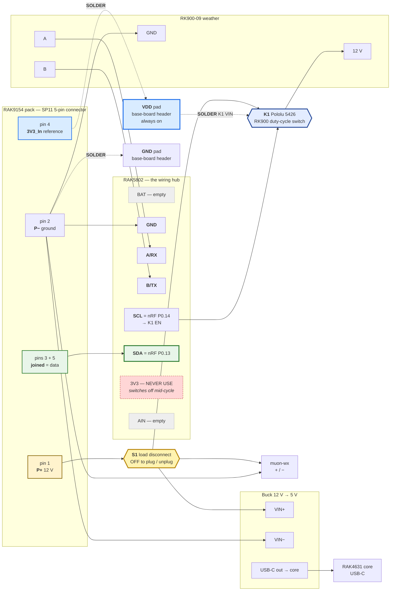

# Hardware — WisBlock RK900 + RAK9154 node

🚧 **NOT YET BUILT.** Bench/field status: none.

Authoritative behavior: [`FIRMWARE_SPEC.md`](FIRMWARE_SPEC.md). Libraries: [`LIBRARIES.md`](LIBRARIES.md).
Numbered assembly procedure: [`BUILD.md`](BUILD.md).

This file holds the electrical rationale: what each connection is, why, and what was measured.
The one build diagram and the numbered steps are in `BUILD.md`; the reasoning behind the
2026-09-05 wiring decision is [ADR-0011](decisions/ADR-0011-no-current-across-the-plug-while-mating.md).

## Mission

Class A LoRaWAN US915 end node: poll **RK900-09** + **RAK9154**, uplink on downlink-settable interval, woods-hardened.

## BOM (ordered path)

| Role | Part | SKU |
|---|---|---|
| Core | RAK4631 US915 | **116000** |
| Base | RAK19007 | **110082** |
| RS-485 | RAK5802 | **100003** |
| Antenna | Blade 915 RP-SMA (if needed) | **926019** |
| Enclosure | Unify **solar** variant — the no-solar 910406 was out of stock | **910421** (confirm) |
| Buck | 12 V → 5 V | (separate) |
| RK900 duty-cycle switch `K1` | Pololu Isolated Solid State Relay/Switch, SPST, 100 V, 4.5 A [CIT-POLOLU-5426] — in hand for 002/003; wiring agreed in [#117](https://github.com/disruptivepatternmaterial/rak-sensor-node-but-better/issues/117), **firmware not yet written** | Pololu **5426** |
| Pack cable | one SP11 plug mating `SP1110/P5` [CIT-RAK-WX-MANUAL] | — |
| Load disconnect `S1` | switch or inline fuse holder on `P+`, ≥ 2 A at 13.2 V DC — **part not yet chosen**, gets a `CITATIONS.md` row when it is | — |
| Power source | RAK9154 Solar Battery Lite, **large-panel variant** | — |

**Not used:** RAK13002 (conflicts with 5802 IO slot), GNSS, RTC, AS923 kit **119012**.
**Evaluated, not adopted:** RAK19010 (110086) + RAK19016 as a field base — see § "What the
schematics establish"; the hardware stays as built.

### The enclosure that arrived has its own solar panel — leave it unconnected

The shell in hand is the solar variant (roomier than the planned 910406 — the buck fits). Its
panel stays dead weight: the RAK9154 must remain the only power source, because four of the nine
uplink fields and the brownout gate come from interrogating that pack over its 5-pin socket
([ADR-0004](decisions/ADR-0004-bms-one-wire-path.md)), and a second uncontrolled array on the
pack's charge input is a way to damage its 18 V controller. The pack is solar in its own right
[CIT-RAK9154-SOLAR]; only the shell was a stock substitution. Do not "make use of" the lid panel
without revisiting this. Cable-entry planning is issue #20.

**Select the buck on its no-load quiescent current** — it is a 24/7 load in parallel with the
whole firmware, and a few idle milliamps would exceed the node's entire average draw.

## RAK9154 ports (critical)

The pack has **two** load sockets. Connector reference:
`forest-weather-machines/rak-4-5-wire/docs/01-connector-reference.md` [CIT-RAK45WIRE] —
the sibling repo is cloned at `~/Documents/GitHub/forest-weather-machines`, not beside this
repo, so it is cited rather than linked. See [`CITATIONS.md`](CITATIONS.md).

Electrically ([CIT-RAK9154-ELEC], the pack's own block diagram): the 4-pin `Load ±` is the
battery rail through the pack's current protection (9–13.2 V raw); the 5-pin `12 V out ±` is a
**boost** stage; both negatives are the battery negative. `3V3 in` and `One-Wire` feed the pack's
IO MCU, whose level shifter runs from whatever the node puts on pin 4.

### A — 4-pin Gateway Load (SP1110/P4) — **not used**

| Pin | Signal |
|---|---|
| 1 | P+ (9–13.2 V raw battery) |
| 2 | P− |
| 3 | RS-485 A |
| 4 | RS-485 B |

Modbus slave `0x6E`, 9600 8N1 (FIRMWARE_SPEC §2.2) — the BMS-over-RS-485 fallback that
[ADR-0004](decisions/ADR-0004-bms-one-wire-path.md) set aside for one-wire. Documented so the
pinout is on record; nothing on this node plugs into it.

### B — 5-pin Sensor Hub Load (SP1110/P5) — **the only plug: power, ground, data**

**Mating part: `SP1110/P5-N` plug** (SP11 series, IP67, screw-locking circular, 2 A, 0.75 mm
contacts × 5). The socket on the pack is `SP1110/P5`; the cable-end plug that mates with it is
the `-N` variant [CIT-RAK9154]. Buying the plug is preferable to cutting the supplied cable,
which keeps the assembly weatherproof and reversible.

The connector visible **inside** a Sensor Hub shell is the board-side end of that bulkhead and
is a different, unpublished part — RAK does not document it, so it cannot be ordered by part
number. Measure the pin pitch before assuming a JST family (1.0 mm SH, 1.25 mm GH, 1.5 mm ZH,
and 2.0 mm PH all look alike in a photograph). Mating it saves a gland but ties the build to an
undocumented part.

| Pin | Signal | This node |
|---|---|---|
| 1 | P+ (12 V boost) | → **`S1` load disconnect** → every load (node supply, RK900, muon-wx). `S1` is open whenever this plug is being mated or unmated — § "The wiring plan" |
| 2 | P− | → all load negatives and the base-board `GND` pad; a second conductor → RAK5802 `GND` clip |
| 3 | TXD | joined to pin 5 → the one-wire wire → RAK5802 `SDA` clip |
| 4 | 3V3_In | → base-board `VDD` pad (the always-on `3V3`, ADR-0010) — **never 5 V**, never the RAK5802 `3V3` clip |
| 5 | RXD | joined to pin 3 |

2 A contacts [CIT-RAK-WX-MANUAL] — the ceiling for all loads combined; `POWER_BUDGET.md` keeps
the sum.

**Not** full-duplex UART to RX1/TX1 as two independent lines without bridging — Hub protocol is half-duplex one-wire @ 9600. See Meshtastic / RAK-OneWireSerial / `rak-4-5-wire`.

## RAK5802 terminal blocks — what each one actually is

Two 4-way spring terminals, silkscreened `BAT GND A/RX B/TX` and `SCL SDA 3V3 AIN`. Eight clips
total. **Six of the node's seven external connections land in them**, which is why the wiring plan
uses this module as the hub rather than the base-board header.

| Block | Clip | What it is | What this node puts in it |
|---|---|---|---|
| 1 | `BAT` | battery rail **output**, 2.6–4.2 V, for powering a sensor [CIT-RAK5802] | *empty* |
| 1 | `GND` | common ground — same net as the base-board `GND` pad | pack pin 2 (`P−`) |
| 1 | `A/RX` | RS-485 A, non-inverting | RK900 `A` |
| 1 | `B/TX` | RS-485 B, inverting | RK900 `B` |
| 2 | `SCL` | I²C clock, an otherwise unused GPIO — nRF P0.14, with the base board's 4.7 kΩ pull-up to `VDD` [CIT-RAK19007-SCH-SLOTS] | `K1` `EN` (Pololu 5426), [#117](https://github.com/disruptivepatternmaterial/rak-sensor-node-but-better/issues/117) |
| 2 | `SDA` | **nRF P0.13 — the one-wire pin**, direct passthrough, no buffer | pack pins 3+5 joined |
| 2 | `3V3` | **switched** output on `3V3_S` — dies mid-cycle | *empty. never use* |
| 2 | `AIN` | one analog input | *empty* |

Each clip takes **one** conductor. `BAT` and `3V3` are sensor-power **outputs**, not supply
inputs, and `3V3` is on `3V3_S`, which `src/sensors/rk900.cpp` drops LOW after each weather read —
so pack pin 4 taken from that clip would go dark exactly when the battery is read. Pin 4 goes to the
always-on `VDD` pad (ADR-0010).

## RK900

4-wire: V+, GND, A, B → RAK5802 @ **9600**, slave `0x01`. Probe IO optional as junction box
only. The datasheet and the one field-deployed twin both say 4800; **this physical unit
answers only at 9600** and gives zero bytes at 4800 across four consecutive sweeps
([ADR-0006](decisions/ADR-0006-rk900-baud-and-register-map.md), 2026-08-03, `998dc26`).
Wiring from 4800 costs a bench session debugging a bus that is silent by configuration.

## P0 wiring — decided

Per [ADR-0004](decisions/ADR-0004-bms-one-wire-path.md). The two sensors are on **separate
buses**, so neither can interfere with or block the other.

### The wiring plan — 2026-09-05 ([ADR-0011](decisions/ADR-0011-no-current-across-the-plug-while-mating.md))

Everything crosses the one 5-pin plug; the 4-pin socket is not used. The hardware is as built —
RAK19007, buck, USB-C. The plug's contacts do not
land together and `P−` lands last — measured, ~25 times, two packs, core removed. The connector
cannot be changed and the pack cannot be changed, so the one variable left is **how much current
is flowing at the instant the contacts land: none.** A manual load disconnect (`S1`) sits on `P+`
inside the enclosure and is **open for every mate and every unmate**. With `S1` open nothing draws
through pin 1, node ground cannot be pulled toward `P+`, and the data wire has no current to carry
— in whatever order the five contacts touch.

| From pack 5-pin | To | Notes |
|---|---|---|
| Pin 1 `P+` (12 V boost) | **`S1` load disconnect**, then the terminal block `+` bus | `S1` is the fix. Everything downstream of it is unchanged from the harness as built |
| `+` bus | buck `VIN+` (buck `VOUT` 5 V → the board's USB-C, as today) | |
| `+` bus | **`K1` load slot A** (Pololu 5426) | the RK900 duty-cycle switch, high-side, in the RK900 branch only [#117](https://github.com/disruptivepatternmaterial/rak-sensor-node-but-better/issues/117) |
| `K1` load slot B | RK900 `V+` | the two load slots are symmetric back-to-back MOSFETs [CIT-POLOLU-5426] |
| `K1` `VIN` | base-board `VDD` pad | same always-on `3V3` that feeds pack pin 4 — the `VDD` pad carries **two** conductors. Never the RAK5802 `3V3` clip (`3V3_S`) |
| `K1` `GND` | terminal block `−` bus | |
| `K1` `EN` | RAK5802 `SCL` clip (nRF P0.14) | control input, 2.7–40 V = on. **Nothing drives `SCL` yet** — see the note below the table |
| `+` bus | muon-wx `+` | |
| Pin 2 `P−` | terminal block `−` bus → buck `VIN−`, RK900 `−`, muon-wx `−`, and **`GROUND A` → base-board `GND` pad** | |
| Pin 2 `P−` | a second conductor from the same pin, **`GROUND B` → RAK5802 `GND` clip** | redundancy against a return going intermittent after mating — not a mating-order fix, and not claimed as one |
| Pins 3 + 5 joined | RAK5802 `SDA` clip (nRF P0.13) | the one-wire line. The base board already pulls it up with 4.7 kΩ to `VDD` (`R10`, [CIT-RAK19007-SCH-SLOTS]); no external pull-up needed on this landing |
| Pin 4 `3V3_In` | base-board `VDD` pad | the always-on `3V3` looped through the core (ADR-0010). Never the RAK5802 `3V3` clip (`3V3_S`, switched by `IO2`), never 5 V |

Both pads named above are on the 2.54 mm edge header (`SDA SCL TX1 RX1 GND VDD BOOT0`). `SDA`,
`SCL` and `GND B` land in spring clips; `VDD` (two wires: pack pin 4 and `K1 VIN`) and `GND A`
are solder joints.

**`K1` before its firmware exists — a hypothesis to meter, not a claim.** #117 says "until
firmware drives `SCL`, the switch stays open and the head is dark." The schematic says the base
board pulls `I2C1_SCL` to `VDD` through `R11` 4.7 kΩ [CIT-RAK19007-SCH-SLOTS], so an undriven
`SCL` clip sits at ~3.3 V, inside `K1`'s 2.7–40 V on-range. Whether 4.7 kΩ can source enough
current to light the optocoupler's LED is not on Pololu's page (`EN` input current is not
specified). So the default state of an unfirmwared `K1` is **unknown**: meter `K1`'s load side with
the board powered, no core, `SCL` undriven, and record it. If it reads on, the RK900 simply runs
continuously as it does today until the firmware lands; nothing is damaged either way. The
firmware (drive `SCL` HIGH → settle → poll → LOW) is [#117](https://github.com/disruptivepatternmaterial/rak-sensor-node-but-better/issues/117)
and is **not** in any image yet. `FEATURE_BATTERY_PIN_SCL` and `K1` cannot both be on.

**`S1` requirements.** Breaks `P+` only — never `P−`. Rated for the plug's ceiling, 2 A at 13.2 V
DC [CIT-RAK-WX-MANUAL]. Reachable with the lid open and nothing unplugged. Either a toggle/rocker
switch or an inline blade-fuse holder with the fuse pulled — the fuse holder also gives the
harness the overcurrent protection it has never had. **No part is chosen here**; the one the
operator picks gets a `CITATIONS.md` row before it goes on the BOM. It is labelled at the switch:
**`OFF before plugging or unplugging the pack`**.

**Procedure and the node's state while `S1` is open** are in ADR-0011 § "Decision": `S1` OFF → mate
→ `S1` ON; `S1` OFF → unplug. No wait is needed; node-side capacitors discharge into node-side loads.

**The whole-node picture.** Solid lines are spring clips or terminal-block landings; dashed lines
are solder joints on the base-board header. The build-sequence version is
[`BUILD.md`](BUILD.md) § "The build, in one picture".

Read it against the failure: on 2026-09-05 pin 1 was feeding the buck and the RK900 while pin 2
was still in the air, and the only way back to the pack for that current was pins 3/5 → `SDA` →
the pad. With `S1` open at that moment pin 1 feeds nothing.

**What `S1` does not do.** It depends on a hand. Mate with `S1` on and today's fault is back,
unchanged. The label and the procedure are the whole guard; there is no interlock. That is the
cost of a one-plug design, and it is stated here rather than hidden.

**What has to be measured before a core goes near it** — ADR-0011 § "Exit criteria": the harness
on a coreless board with `S1` fitted, analyzer on the pins 3+5 wire against node ground,
≥ 10 mate/unmate cycles by the ADR-0011 procedure, **no excursion below −0.3 V**. Runs 6 and 7
(same harness, no `S1`, every mating below −0.3 V) are the control; this is that test with one
variable changed. Then a meter-checked core, one cycle, pad still megohms to ground.

### The two data rules, stated plainly

> **Pack pins 3 and 5 (TXD and RXD) are joined. The resulting data line does not reach `SDA`
> until the harness with `S1` above has passed its mating test with no core fitted.**
>
> **Pack pin 4 (`3V3_In`) goes to the `VDD` pad on the base board. Not to the RAK5802's `3V3`
> terminal, and never to 5 V.**

### The ground pin lands last — measured 2026-09-05

**This is the pin killer, measured on node 002 with the analyzer and no pad in the circuit**
([`EVIDENCE.md`](EVIDENCE.md) 2026-09-05 (later)). Re-mating the pack's 5-pin connector put the
joined pins 3+5 wire at **−8.13 V** relative to node ground, then at **−6.3 V** with the pack
transmitting on top of it, for **183 ms** in total; a 61 µs spike to **+4.30 V** preceded it. The
pad's limits are −0.3 V and VDD + 0.3 V [CIT-NRF-GPIO].

Why: for those 183 ms, `P+` (pin 1) and the data pin had made contact and `P−` (pin 2) had not.
The node's entire supply current had to return to the pack, and the only conductor left was the
data wire — through the pack's pull-down, and, with a core fitted, **through the nRF pad's ground
clamp diode in the reverse direction** [CIT-NRF-GNDLOSS]. That is the direction that destroys the
pin's low side and leaves it shorted to ground, which is how all nine dead pads measure and the
one end state back-powering cannot produce [CIT-NRF-GNDLIFT]. Node 001's connector has been
mated once; node 002's dozens of times.

Also measured in the same session and **cleared**: pulling and re-inserting the buck's USB-C,
plugging and unplugging the bench USB cable, and pressing RESET — the wire stayed within
0 … +3.46 V throughout. Handling the power connectors is not what kills pads; handling the
**pack** connector is.

**Repeat trials the same afternoon** ([`EVIDENCE.md`](EVIDENCE.md) runs 6 and 7): ~25 matings,
two different packs (002's and the never-used 003's), **core removed from the board** — every
single plug-in went below −0.3 V, most to −7 V. So this is not chance, not one bad pack, and not
anything the node does: the load pulling node ground toward `P+` during the partial mate is the
RK900 and/or the buck, which stay wired whether or not the node is powered. **There is no
handling sequence on the node side that prevents it.** Why node 001 has survived many matings is
unmeasured and stays that way until its harness is on a bench.

> **Rule: no nRF pad is connected to the pins 3+5 wire unless no supply current crosses the
> 5-pin connector while it is being mated or unmated.** Adopted 2026-09-05 as
> [ADR-0011](decisions/ADR-0011-no-current-across-the-plug-while-mating.md): a load disconnect
> `S1` on `P+` inside the enclosure, open for every mate and unmate — see § "The wiring plan"
> above. The 4-pin socket is not in play. The powered-off isolation switch
> ([#101](https://github.com/disruptivepatternmaterial/rak-sensor-node-but-better/issues/101))
> is not adopted: it addresses a different mechanism and an ESD-class part cannot absorb 183 ms
> of reverse conduction.
>
> Until the harness with `S1` has passed its mating test, a fresh core on the pins 3+5 wire is
> expected to lose that pad on a mating.

CITE(bench): [`EVIDENCE.md`](EVIDENCE.md) 2026-09-05 (later) — capture
`20260905_002_events.sal`, Logic Pro 8 `AF11F852CEC20A9`, Heliotrope Ridge.
CITE(datasheet): [CIT-RAK-WX-MANUAL] — `SP1110/P5` pinout and 2 A contact rating.

### Qualifying the pack harness — what the analyzer established

Procedure: [`BUILD.md`](BUILD.md) § B. Numbers: [`EVIDENCE.md`](EVIDENCE.md) capture 13 and the
2026-09-05 mating runs. What matters from them:

- **The pack's data line is not an overvoltage source.** With pin 4 held at 3.29 V the line idles
  at **+3.31 V** and drives LOW to **+0.09 V** — inside a powered pad's −0.3 … 3.6 V
  [CIT-NRF-GPIO]. It is an active low-side driver, not a passive pull-down, and it carries a
  ~15 kΩ pull-down to pack ground.
- **The pack's reference is the node.** Pin 4 (`3V3_In`) powers the pack's IO MCU, so a data wire
  probed with the node unplugged reads a flat 0 V — measured 2026-08-30 — whatever the harness
  would do when powered. **A 0 V reading with pin 4 dead is not a cleared harness.** Qualify with
  pin 4 energised from a current-limited 3.3 V bench supply and the joined pins 3+5 wire on the
  analyzer only; `scripts/owprobe.py` refuses to clear a capture that never leaves the open-probe
  noise band.
- **The analyzer goes first, always.** A Logic Pro 8 input takes ±25 V at 2 MΩ
  [CIT-SALEAE-LOGICPRO8]; a powered pad takes 3.6 V and an unpowered one 0.3 V
  [CIT-NRF-GPIO] [CIT-NRF-BACKPOWER]. A meter averages the 183 ms transient that matters into
  nothing; a 781 kS/s analog capture shows it.

### The nine dead pads — what was tried, and why each was dropped

All nine died under agent-written diagnostic firmware, none under the production image
([#102](https://github.com/disruptivepatternmaterial/rak-sensor-node-but-better/issues/102)).
All nine read as a short to ground — the lower clamp's failure direction. The cause was measured
2026-09-05 (§ above). Everything below predates that measurement and is kept only so it is not
re-proposed; the full text lives in the git history of this file at commit `8b0ae85`.

| Tried | Verdict | Where the evidence is |
|---|---|---|
| Back-powering an unpowered pad from the pack's 3.3 V line [CIT-NRF-BACKPOWER] [CIT-NRF-UNPOWERED-PIN] | Real, but produces a *high-side* failure; nine pads failed *low*. Dropped. | #102, [CIT-NRF-PINSHORT] |
| Driver contention on the one-wire line ([#99](https://github.com/disruptivepatternmaterial/rak-sensor-node-but-better/issues/99)) | Cannot explain a short to ground on pads that never transmitted. Dropped as the cause; still a firmware hygiene item. | #99 |
| Pack overvoltage on the data line | Measured at 3.31 V. Cleared. | capture 13 |
| 5 V on the `VDD` pad, miswired harness, a slot module holding `IO1`, ESD | Each tested and refuted 2026-08-30. | `EVIDENCE.md` 2026-08-30 |
| A 1 kΩ series resistor on the data line ([#101](https://github.com/disruptivepatternmaterial/rak-sensor-node-but-better/issues/101)) | Fitted when `SDA` failed; refuted by our bench and by TI. Not protection. | #101 |
| A powered-off isolation switch (`SN74CBTLV1G125` [CIT-SN74CBTLV1G125] [CIT-TI-POWERED-OFF-SWITCH]) | Guards the unpowered-node case, not the measured one; ESD-class parts are not rated for 183 ms of reverse conduction [CIT-LRC399-04AT1G]. Not adopted. | ADR-0011 |
| Two independent ground conductors, a "ground first, break last" mating ritual [CIT-NRF-GNDLIFT] [CIT-NRF-GNDLOSS] | Both grounds come off the same pin 2, which lands last; a ritual cannot reorder contacts inside the plug. Kept as post-mate redundancy only. | § "The ground pin lands last" |
| Moving the pad — `IO1` → `A1` → `SDA` | Three pads on three cores died the same way. The pad was never the variable. `SDA` stays because it is a spring clip with the base board's own 4.7 kΩ pull-up [CIT-RAK19007-SCH-SLOTS]. | `EVIDENCE.md` 2026-08-29/30 |

Two habits survive from that period because they are free: **meter every incoming core's `IO1`,
`A1`, `SDA` to `GND` before it goes in a base board** (megohms; no core was ever measured before
installation, which is why "arrived shorted" cannot be told from "shorted here"), and **never
fit a replacement core into a harness that has not passed the ADR-0011 mating test.**

## Enclosure

Unify **solar variant** (the no-solar 910406 was out of stock — see the BOM note above). Its
lid panel stays unconnected.

### Mounting the board — the baseplate holes do not line up

The Unify shells use a removable mounting plate rather than bosses in the shell itself, and the
plate that ships with the enclosure is not drilled for the RAK19007. Three ways out, best first:

1. **Buy RAK's mounting plate.** Sized `137 × 87 × 6.8 mm` for the 150×100×45 shell, ABS
   UL94V-0, and it comes with the self-tapping screws. It holds a RAK19001 *and* a RAK19007
   simultaneously, and builds in the required 3 mm standoff between the plate surface and the
   PCB underside — [store.rakwireless.com](https://store.rakwireless.com/products/unify-enclosure-mounting-plate).
   Confirm the size against the shell in hand first; the solar variant was not the planned one.
2. **Print RAK's blank plate and add your own bosses.** `Medium-Blank.step` / `.stl` in
   [Awesome-WisBlock](https://github.com/RAKWireless/Awesome-WisBlock/blob/main/Unify-Enclosure/README.md).
   This is likely the better route here, because the buck converter and the pack's field wiring
   also need somewhere to live, and the bought plate only accounts for WisBlock boards. The same
   folder has drill guides for the USB-C cutout and for gland/antenna holes, which is directly
   useful for the second cable entry (issue #20).
3. **Ready-made prints.** A finished RAK19007 plate by pdxlocs on
   [Printables](https://www.printables.com/model/622358-rak-unify-enclosure-simple-rak19007-mounting-plate)
   (drawn for the smaller shell — check before printing), and a dimensionally accurate RAK19007
   board model by Radish on [Printables](https://www.printables.com/model/1694959-rak-wireless-wisblock-19007-baseboard)
   for laying out hole positions in your own design.

Board facts for any custom plate: the RAK19007 is `30 × 60 mm`, mounting-hole locations are in
Figures 12–13 of its datasheet, and the board ships with `M2.5 × 4` screws for exactly this
[CIT-RAK19007]. Keep the 3 mm standoff — the underside carries the sensor-slot connectors and
the pad header being soldered to.

## What the schematics establish — read 2026-09-05

RAK ships a schematic image at the bottom of every datasheet page. Until 2026-09-05 none of them
had been opened for this project; the prose around them was cited instead. Reading the four this
node uses settled one open ADR, corrected one registry claim, and surfaced one unread register.
Sources: [CIT-RAK4631-SCH], [CIT-RAK19007-SCH-POWER], [CIT-RAK19007-SCH-SLOTS], [CIT-RAK5802-SCH],
[CIT-RAK9154-ELEC], [CIT-RAK19016-SCH].

**Rails on a RAK19007 + RAK4631, by net name on the drawings:**

| Net | Made by | Reaches |
|---|---|---|
| `VBUS_D` | USB-C, `Green_Power` (P2), or `VCC_IN`, each through a `MBR140SFT1G`; **clamped by `D3` 5.6 V Zener** | `TP4054` charger |
| `VBAT` | `TP4054` output (4.2 V float with no cell) or the battery | CPU-slot 1/2 → **the nRF52840's `VDDH`** (`VBAT_NRF`, `R1` 0 Ω). The MCU is powered from here, not from `3V3` |
| `VCC` | `VBUS_D` via `D8`, or `VBAT` via PMOS `Q3` (battery cut off while USB present) | `SGM6036-ADJ` buck |
| `3V3` | `SGM6036-ADJ` `U3`, always enabled | CPU-slot 5/6 → RAK4631 → **looped back on 17/18 as `VDD`**; also `VBAT_SX`, `VBAT_IO_SX`, `VDD_FLASH` on the core |
| `VDD` | = `3V3` through the core (`R4` to `VDD_NRF` is NC — the MCU's own `VDD` pin is *not* on this net) | edge-header `VDD` pad, `R10–R13` 4.7 kΩ I²C pull-ups, sensor-slot 9/10, IO-slot 17/18 |
| `3V3_S` | `3V3` through PMOS `Q7`, gate driven by `IO2` via `Q8` | IO slot 5/6 → RAK5802 (`R50` 0 Ω), sensor slots, RAK5802 `3V3` clip |

Consequences, each one a thing this repo had wrong or unknown:

1. **ADR-0010 is closed.** The header `VDD` pad is the base board's own 3.3 V, delivered through
   the core's connector. Coreless → open circuit; cored → the right place for the pack's pin 4.
2. **The pad limit is referenced to a rail nobody has read.** The nRF52840 runs in high-voltage
   mode from `VBAT`; its GPIO rail is the internal `REG0` output set by `UICR.REGOUT0`, **default
   1.8 V** unless the bootloader wrote 3.3 V [CIT-RAK4630-RAW] [CIT-ADA-BOOTLOADER-REGOUT0]. RAK's
   bootloader ships as hex, so the source is not checkable; the chip is — a word read at
   `0x10001304` over SWD, non-destructive. **Open check:** read it on the bench core, and on any
   core that has been `ERASEALL`'d (node 002's replacement, 2026-08-30 — that erases UICR). If it
   reads the default, a 3.3 V line into a 1.8 V-referenced pad is 1.2 V over its ceiling on every
   idle bit. Hypothesis, not finding — measure before saying anything more.
3. **The `SDA` clip is P0.13 with a 4.7 kΩ pull-up to `VDD` and nothing else** — no series
   element on the RAK5802, no buffer. The RAK5802's `TCON` (pin 29 = `IO1`) is wired through an
   NC resistor: the module places no load on `IO1`, which removes one 2026-08-30 hypothesis.
4. **The RAK5802's own protection is RS-485-only and ESD-class.** `LRC399-04AT1G` across `A`/`B`
   [CIT-LRC399-04AT1G]; the `TP8485E` bus pins tolerate −9 to +14 V [CIT-TP8485E]. That is why
   the RS-485 side has never lost a pin to the mating fault and the one-wire side has lost nine.
5. **`CIT-RAK19007-DS` said the USB-C input had no clamp. It has one** (`D3`, 5.6 V, 500 mW). The
   5.5 V ceiling stands — a half-watt Zener clamps a transient, not a supply.

**The RAK19010 (SKU 110086) + RAK19016 alternative — evaluated 2026-09-05, not adopted; the
hardware stays as built.** Record in
[ADR-0011](decisions/ADR-0011-no-current-across-the-plug-while-mating.md) § "Base board" and the
`CIT-RAK19010-RAW` / `CIT-RAK19016-*` registry rows, so the question does not have to be
researched twice. Short form: a cleaner power front end (12 V straight onto a screw terminal,
reverse-polarity gate, `SGM61230`, same `SGM6036` 3.3 V stage, no USB in the power path) that
changes **nothing** about the pad problem and costs the USB port entirely.

### Two RAK19007 power facts from the forum, still useful

- **Green Power connector** (P2, JST ZHR-2): a regulated 4.5–5.5 V input that bypasses USB-C
  entirely — RAK staff's own recommendation for running a WisBlock off a buck. Below ~4.5 V the
  regulator misbehaves and draws *more*. Not used here (the buck feeds USB-C), but it is the
  fallback if a board's USB path dies.
  [CITE(prior-art): RAK forum — Green Power up to 5.5 V, independent of USB](https://forum.rakwireless.com/t/rak19007-rak4631-usb-and-j12-vdd-can-be-connected-at-the-same-time/9870)
  [CITE(prior-art): RAK forum — the 4.5 V floor](https://forum.rakwireless.com/t/powering-my-rak-board/7750)
- **JST polarity is only in the datasheet figures.** Go by the `+` silkscreen; a reversed battery
  connector has burned boards.
  [CITE(prior-art): RAK forum — reverse-polarity damage](https://forum.rakwireless.com/t/cross-polarization-damage-to-wisblock/12903)

## Reflashing a sealed field node

Moved to [`FIELD_UPDATE.md`](FIELD_UPDATE.md): BLE OTA DFU through the shipped bootloader, the
`GPREGRET` downlink path, the `firmware.zip` artifact, and why a USB pigtail loses. Hardware
consequence for this file: the enclosure can be sealed with the USB-C occupied by the buck.
